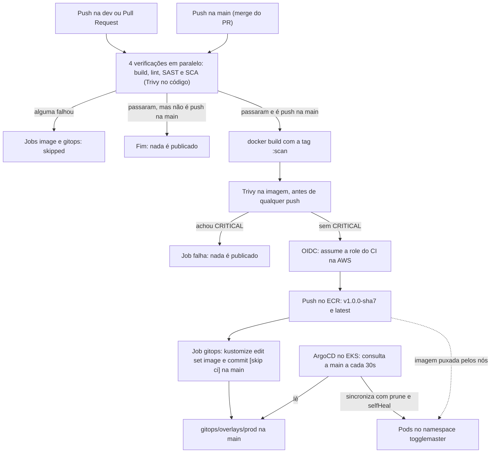
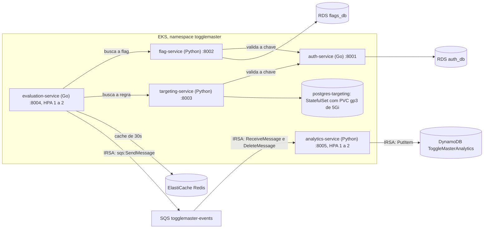

# ToggleMaster, Tech Challenge Fase 3 (FIAP POSTECH, Grupo 203)

[](https://www.terraform.io/)
[](https://github.com/features/actions)
[](https://trivy.dev/)
[](https://argo-cd.readthedocs.io/)
[](https://kubernetes.io/)

O ToggleMaster é uma plataforma de *feature flags*: interruptores que ligam e desligam funcionalidades de um aplicativo em tempo real, sem novo deploy. Nesta fase, o ambiente da aplicação deixa de ser montado à mão: a infraestrutura vira código Terraform, cada versão passa por um pipeline com checagens de segurança, e o cluster se atualiza sozinho a partir do Git (GitOps). Projeto entregue. Em 2026-09-15 o ambiente AWS foi recriado do zero, demonstrado e destruído; tudo pode ser recriado pelo [guia de reprodução](docs/GUIA_DE_REPRODUCAO.md).

## Links da entrega

| Item | Onde |
|---|---|
| Repositório | https://github.com/fiap-devops-arqcloud-2026/tech-challenge-03 |
| Vídeo da entrega | PREENCHER_URL_DO_VIDEO |
| Relatório de entrega | [docs/RELATORIO_DE_ENTREGA.md](docs/RELATORIO_DE_ENTREGA.md) |
| Enunciado | [docs/POSTECH - Tech Challenge - Fase 3.pdf](docs/POSTECH%20-%20Tech%20Challenge%20-%20Fase%203.pdf) |
| Guia de reprodução (comandos, tempos, armadilhas) | [docs/GUIA_DE_REPRODUCAO.md](docs/GUIA_DE_REPRODUCAO.md) |
| Referência técnica (portas, IRSA, Secrets, versões) | [docs/ARQUITETURA.md](docs/ARQUITETURA.md) |
| Estimativa de custo (captura de 2026-09-11) | [docs/evidencias/estimativa-custos-aws-2026-09-11.png](docs/evidencias/estimativa-custos-aws-2026-09-11.png) |
| Evidências sem AWS (2026-09-15) | Falha de segurança: [run 34985289399](https://github.com/fiap-devops-arqcloud-2026/tech-challenge-03/actions/runs/34985289399) · correção verde: [run 34985477955](https://github.com/fiap-devops-arqcloud-2026/tech-challenge-03/actions/runs/34985477955) · [PR #16](https://github.com/fiap-devops-arqcloud-2026/tech-challenge-03/pull/16) · publicação na main: [run 34997028995](https://github.com/fiap-devops-arqcloud-2026/tech-challenge-03/actions/runs/34997028995) · commit do robô: [a0c7b8e](https://github.com/fiap-devops-arqcloud-2026/tech-challenge-03/commit/a0c7b8e06f9e12da5bc838d64ead841e1f91072f) |

O ambiente não está no ar; a prova é o vídeo mais os runs e commits acima.

## 1. O problema e o intuito do projeto

Na Fase 2 o ToggleMaster já rodava na AWS, mas o ambiente tinha sido montado clicando no console. Se caísse, remontar levaria dias e sairia diferente. A Fase 3 resolve isso: tudo o que sustenta a aplicação passa a existir como código revisável.

A aplicação tem cinco microsserviços: `auth`, `flag`, `targeting`, `evaluation` e `analytics`. Ela é herança da Fase 2 e não é o entregável desta fase; a explicação completa está no [repositório da Fase 2](https://github.com/fiap-devops-arqcloud-2026/tech-challenge-02).

O enunciado descreve quatro sintomas, e cada um tem uma resposta aqui:

| Sintoma descrito no enunciado | A resposta neste repositório |
|---|---|
| Desenvolvedores rodando `kubectl apply` das próprias máquinas, gerando conflitos de versão | **GitOps com ArgoCD.** Ninguém aplica nada à mão: o Git é a fonte da verdade e o cluster se ajusta ao que está escrito lá |
| Credenciais do banco passadas em arquivos de texto sem segurança | **Nenhum segredo versionado.** As senhas são geradas pelo Terraform; o CI entra na AWS por identidade federada (OIDC) e os pods por identidade de conta de serviço (IRSA), sem chave estática de nuvem |
| Uma vulnerabilidade em biblioteca Go passou despercebida e foi para produção | **Pipeline DevSecOps.** Análise de dependências, análise estática e varredura da imagem; vulnerabilidade crítica impede a publicação da imagem |
| Recriar o ambiente de homologação leva dias, porque foi feito no console | **Terraform.** Três camadas recriam o ambiente igual todas as vezes, e o destroy apaga tudo |

A frase que organiza a fase inteira: **"se não está no código, não existe"**.

| O que | Fase 2, na mão | Fase 3, automatizado |
|---|---|---|
| Montar o ambiente | Dezenas de cliques no console | `terraform apply` em três camadas, reproduzível |
| Derrubar no fim do dia | Apagar node group, bancos, cache e rede um por um | `terraform destroy` na ordem inversa |
| Publicar uma versão nova | Alguém lembra de construir e enviar as cinco imagens | Nasce do push na `main`, depois das checagens |
| Levar a versão ao cluster | `kubectl apply` do notebook de alguém | O ArgoCD reconcilia o que está no Git |
| Credenciais da AWS | Chave estática num Secret | OIDC no CI e IRSA nos pods |
| Biblioteca com falha crítica | Só se alguém reparasse | O pipeline barra antes de a imagem ser publicada |

A aplicação não mudou. O que mudou é tudo o que está em volta dela.

## 2. Arquitetura

### 2.1 A esteira, do commit ao pod

Não existe seta saindo da máquina de um desenvolvedor para o cluster: esse caminho foi removido de propósito. Na `dev` e em Pull Requests rodam só as quatro verificações; imagem e GitOps só acontecem no push na `main`.



Só vulnerabilidade **CRITICAL** bloqueia. HIGH e abaixo aparecem no log, mas não derrubam o pipeline.

### 2.2 O que roda na AWS

Tudo é criado por Terraform, em três camadas. Cada camada lê as saídas da anterior pelo estado remoto.

```mermaid
flowchart LR
    subgraph BASE["terraform/ (base)"]
        VPC["VPC 10.0.0.0/16: 2 sub-redes públicas, 2 privadas e 1 NAT"]
        ECRR["5 repositórios ECR"]
        SQS["SQS togglemaster-events com DLQ"]
        DDB["DynamoDB ToggleMasterAnalytics"]
        CI["Provedor OIDC do GitHub e role do CI"]
    end
    subgraph CLUSTER["terraform/cluster/"]
        EKS["EKS 1.34: 2 nós c7i-flex.large e 5 addons"]
        RDS["2 RDS PostgreSQL 16: auth_db e flags_db"]
        REDIS["ElastiCache Redis (redis7)"]
        IRSA["2 roles IRSA: evaluation e analytics"]
    end
    subgraph K8S["terraform/k8s/"]
        ARGO["ArgoCD via Helm (chart 7.7.11) e a Application"]
        SEC["2 namespaces e 5 Secrets"]
        SC["StorageClass gp3"]
    end
    BASE -- "terraform_remote_state" --> CLUSTER
    BASE -- "terraform_remote_state" --> K8S
    CLUSTER -- "terraform_remote_state" --> K8S
```



Dentro do cluster, os serviços conversam assim:



Não há Ingress nem Load Balancer. Todos os Services são `ClusterIP`, e o acesso de fora, quando necessário, é por `kubectl port-forward`. O motivo está em [Decisões e o porquê](#5-decisões-e-o-porquê).

## 3. Tecnologias

| Camada | Tecnologia | Versão principal |
|---|---|---|
| Infraestrutura como código | Terraform, estado no S3 com `use_lockfile` | `>= 1.11` (CI com 1.16.0) |
| Rede | Módulo `terraform-aws-modules/vpc/aws` (único módulo da comunidade) | `~> 5.0` |
| Cluster | Amazon EKS com node group `c7i-flex.large` | Kubernetes 1.34 |
| Bancos | RDS PostgreSQL `db.t3.micro` (2 instâncias) e PostgreSQL em pod | 16 |
| Cache, fila e tabela | ElastiCache `redis7`; SQS com DLQ; DynamoDB sob demanda | — |
| Imagens | Amazon ECR (5 repositórios) | — |
| GitOps | ArgoCD instalado por Helm; Kustomize | chart 7.7.11; Kustomize 5.4.3 |
| CI/CD | GitHub Actions: 5 workflows chamadores e 2 reutilizáveis, mais Terraform Check e Compose Integration | — |
| Linguagens | Go (auth e evaluation); Python (flag, targeting e analytics) | Go 1.25; Python 3.12 |
| Qualidade e segurança | golangci-lint e gosec (Go); flake8, pylint e bandit (Python); Trivy com a action fixada por SHA | golangci-lint v2.13.2; gosec v2.29.0; trivy-action v0.36.0 |
| Teste local | Docker Compose, com o simulador Moto para SQS e DynamoDB | Moto 5.2.2 |

Versões de providers e as ferramentas sem pino (flake8, pylint, bandit e docker do runner): ver [ARQUITETURA, seção 5](docs/ARQUITETURA.md).

## 4. Como funciona cada frente

### 4.1 Infraestrutura como código

O Terraform está dividido em três camadas com estados independentes, no mesmo bucket S3. Assim dá para destruir o que cobra por hora sem perder o resto, e cada camada só é aplicada quando a anterior existe.

| Pasta | O que cria | Chave de estado |
|---|---|---|
| `terraform/` (base) | VPC, NAT, 5 ECR, SQS e DLQ, DynamoDB, OIDC e role do CI | `prod/base.tfstate` |
| `terraform/cluster/` | EKS, node group, 5 addons, 2 RDS, ElastiCache e roles IRSA | `prod/cluster.tfstate` |
| `terraform/k8s/` | Namespaces, 5 Secrets, StorageClass `gp3`, ArgoCD e a Application | `prod/k8s.tfstate` |

- O único passo manual é criar o bucket de estado, porque o Terraform não pode criar o lugar onde guarda a própria memória ([guia, seção 3](docs/GUIA_DE_REPRODUCAO.md#3-bucket-de-estado-do-terraform)).
- A base é **preservável entre sessões**: ela pode ficar de pé enquanto o cluster sobe e desce. Em 2026-09-11 e em 2026-09-15 ela também foi destruída, para zerar os custos.
- Ordem de subida: base, imagens no ECR, cluster, k8s. Destruição na ordem inversa, incluindo a k8s.
- A primeira aplicação da camada k8s tem duas etapas, porque a Application do ArgoCD só pode ser planejada depois que o ArgoCD instala o tipo dela no cluster.

Detalhe técnico: [ARQUITETURA, seção 2](docs/ARQUITETURA.md) e [terraform/README.md](terraform/README.md).

### 4.2 CI e DevSecOps

Cada serviço tem seu pipeline, que só roda quando a pasta dele (ou o workflow da linguagem) muda. Quatro verificações rodam em paralelo; a imagem só é construída se todas passarem.

- **Só CRITICAL bloqueia.** O Trivy roda com `severity: CRITICAL`, `exit-code: "1"` e `ignore-unfixed: false`. As exceções são nominais: o [`.trivyignore`](.trivyignore) tem três CVEs do `perl-base` da imagem Python, com justificativa e revisão marcada para 2026-10-15.
- **Falhou, não publica.** O job `image` declara `needs: [build, lint, sast, sca]`; se um falhar, ele aparece como `skipped`.
- **Scan antes do push.** A imagem é construída com a tag `:scan`, varrida, e só então vêm o login OIDC e o push com a tag `v1.0.0-<sha7>`.
- **Só a `main` publica.** `image` e `gitops` exigem push na `main`. Push na `dev`, Pull Request e disparo manual (`workflow_dispatch`) rodam só as verificações.
- **Testes:** não há arquivos de teste unitário no repositório (nenhum `*_test.go` nem `test_*.py`). A verificação de comportamento é o teste de integração ponta a ponta com Docker Compose, em `scripts/integration/`.

Detalhe técnico: [ARQUITETURA, seção 5](docs/ARQUITETURA.md).

### 4.3 GitOps e fluxo Git

O cluster não recebe ordens: ele persegue o estado escrito em `gitops/overlays/prod` na `main`. Se alguém alterar um objeto à mão, o ArgoCD desfaz.

- **Base e overlay.** `gitops/base` descreve os 5 serviços e o banco em pod; o overlay `prod` guarda o que depende do ambiente: tags das imagens, endereços do Redis e da fila, e as anotações IRSA. Ele renderiza 23 objetos.
- **O robô grava a tag.** O último job do pipeline faz, em até 5 tentativas: `fetch`, `reset --hard origin/main`, `kustomize edit set image`, commit `chore(gitops): <serviço> para <tag> [skip ci]` e push na `main`. Sem merge não há conflito.
- **O ArgoCD aplica.** A Application `togglemaster` tem sincronização automática com `prune` e `selfHeal`. Sem Ingress não há webhook, então o intervalo de consulta foi reduzido de 180 para 30 segundos.
- **Fluxo Git.** Trabalho humano parte da `dev` e chega à `main` por Pull Request. A única exceção é o commit do robô, que vai direto para a `main`, porque é dela que o ArgoCD lê. Por isso a `main` anda sozinha, e a `dev` precisa ser sincronizada antes de começar:

```bash
# Troca para a branch de trabalho humano
git switch dev
# Baixa os commits novos do remoto, inclusive os do robô na main
git fetch origin
# Traz para a dev os commits de tag feitos na main, sem criar merge
git merge --ff-only origin/main
```

Detalhe técnico: [ARQUITETURA, seções 3 e 4](docs/ARQUITETURA.md) e [gitops/README.md](gitops/README.md).

### 4.4 Segurança

Não existe chave estática de nuvem no repositório, nos segredos do GitHub nem no cluster.

- **CI na AWS por OIDC.** A role do CI só faz push nos 5 repositórios ECR. **Pods por IRSA:** `evaluation` só publica na fila; `analytics` só consome a fila e grava na tabela.
- **Senhas geradas pelo Terraform.** As dos 2 RDS nascem na camada cluster e ficam também no Secrets Manager; a do banco em pod, a `MASTER_KEY` e a `SERVICE_API_KEY` nascem na camada k8s e ficam só no Secret do Kubernetes e no estado. Nada disso vai para o Git.
- **Ressalvas conhecidas:**
  - o Redis não usa TLS em trânsito (o tráfego fica na sub-rede privada);
  - a confiança da role do CI aceita qualquer branch ou PR deste repositório, e quem limita a publicação à `main` é a condição do workflow;
  - as tags do ECR são `MUTABLE`;
  - `MASTER_KEY` e `SERVICE_API_KEY` são segredos estáticos de aplicação, guardados em Secret.

Detalhe: [SECURITY.md](SECURITY.md), [gitops/SECRETS-CONTRATO.md](gitops/SECRETS-CONTRATO.md) e [ARQUITETURA, seção 6](docs/ARQUITETURA.md).

## 5. Decisões e o porquê

| Decisão | Por quê | Custo da escolha |
|---|---|---|
| Três estados de Terraform | O destroy do cluster não pode levar ECR, imagens, fila e tabela junto; e os providers da camada k8s dependem do endpoint que o cluster cria | Ordem de aplicação a respeitar e valores literais repetidos nos `backend.tf` e `data.tf` |
| 2 RDS e o banco do targeting em pod | O plano gratuito da conta recusa a terceira instância RDS | Um banco sem gerenciamento da AWS; exige driver EBS e StorageClass |
| Sem Ingress nem Load Balancer | O enunciado não pede exposição externa, e um balanceador custaria cerca de US$ 16 a 20 por mês | Acesso por `port-forward` e ArgoCD sem webhook (consulta a cada 30s) |
| OIDC no CI e IRSA nos pods | Ataca direto a dor das credenciais em texto; a Fase 2 tinha chave estática num Secret | Mais peças de IAM para entender |
| Kustomize para as aplicações; Helm só para o ArgoCD | É nativo do kubectl e do ArgoCD, e o CI altera um único campo com diff auditável | Sem empacotamento parametrizável das aplicações |
| Monorepo com a pasta `gitops/` | O commit de tag acontece no próprio repositório, sem token cruzado | O robô comita na `main` do repositório de código |
| EKS 1.34 | A 1.31, padrão antigo, estava em suporte estendido: control plane de US$ 0,60/h contra US$ 0,10/h | Suporte padrão da 1.34 termina em 2026-12-01 |
| Nós `c7i-flex.large` | O `t3.medium` foi recusado pela conta; o `t3.micro` comporta cerca de 4 pods por nó | Custo por nó maior que o previsto |
| NAT desligável (`enable_nat_gateway`) | O NAT fica na base e custa US$ 0,045/h mesmo sem cluster | Sem NAT, os nós não baixam imagens |
| External Secrets Operator cortado | Seria uma peça nova em execução no caminho crítico; o Terraform cria os Secrets direto | O Secret nasce fora do GitOps e não há rotação sincronizada |
| `dev` → PR → `main`, com exceção do robô | Rastreabilidade do trabalho humano; um PR automático travaria a sincronização | Sincronizar a `dev` antes de começar |
| Variável `create_github_oidc_provider` | A conta já tinha o provedor OIDC do GitHub, criado por outro projeto; com `false` ele só é lido, nunca destruído | Um valor a conferir em cada conta |

## 6. Dificuldades e como superamos

### 6.1 Pipeline verde com CVE crítico escondido

- **Sintoma:** os pipelines passavam verdes. Ao aplicar a regra de bloqueio ao pé da letra, o Trivy barrou o `CVE-2026-56854` (CRITICAL) em `golang.org/x/crypto` v0.20.0, no `auth-service`.
- **Causa:** os passos de varredura usavam `continue-on-error: true`: registravam o achado e seguiam.
- **Solução:** biblioteca atualizada para a v0.55.0 e job de imagem dependente das quatro verificações.
- **Lição:** pipeline verde não prova que o código é seguro; prova só que ninguém configurou o pipeline para reclamar.
- **Evidência:** [run 34360653255](https://github.com/fiap-devops-arqcloud-2026/tech-challenge-03/actions/runs/34360653255) e commit [0d6ad34](https://github.com/fiap-devops-arqcloud-2026/tech-challenge-03/commit/0d6ad34b2447858e23084243aea1edc6eb3939fc).

### 6.2 O plano gratuito recusou o terceiro RDS e o `t3.medium`

- **Sintoma:** a API respondeu `maximum number of instances available with free plan accounts` e `The specified instance type is not eligible for Free Tier`.
- **Causa:** a conta está no plano gratuito, que aceita no máximo 2 instâncias RDS e só tipos elegíveis. É recusa da API, não alerta de custo.
- **Solução:** 2 RDS e o banco do targeting como StatefulSet com disco EBS; nós `c7i-flex.large`. Combinado com o professor em 2026-08-27; comprovante escrito não localizado.
- **Lição:** desvio literal do enunciado precisa de motivo verificável.
- **Evidência:** commit [c7b28cf](https://github.com/fiap-devops-arqcloud-2026/tech-challenge-03/commit/c7b28cffe05ee9ff62477a87431f5d293767c4e6).

### 6.3 A versão padrão do EKS custaria 6 vezes mais

- **Sintoma:** o padrão estava em Kubernetes 1.31.
- **Causa:** a 1.31 já estava em suporte estendido, com control plane a US$ 0,60/h em vez de US$ 0,10/h.
- **Solução:** 1.34, conferida com `aws eks describe-cluster-versions`, em suporte padrão até 2026-12-01.
- **Lição:** valor padrão de módulo envelhece, e o preço envelhece junto.
- **Evidência:** commit [bdaecf1](https://github.com/fiap-devops-arqcloud-2026/tech-challenge-03/commit/bdaecf1a1be0684345d1caa553ab331d2e22b625).

### 6.4 CVEs sem correção contra a regra literal

- **Sintoma:** com `ignore-unfixed: false`, apareceram 3 CRITICAL sem correção no `perl-base` da imagem `python:3.12-slim`.
- **Causa:** a opção `ignore-unfixed: true` escondia essa classe inteira de achados, inclusive os futuros.
- **Solução:** medir antes de endurecer: Trivy nas imagens reais (Python com 3 CRITICAL, `alpine:3.20` com zero). Depois, `ignore-unfixed: false` nos 4 scans e as 3 exceções nominais no `.trivyignore`.
- **Lição:** exceção nominal aparece no diff; opção global some em silêncio.
- **Evidência:** [PR #6](https://github.com/fiap-devops-arqcloud-2026/tech-challenge-03/pull/6), com os 5 serviços verdes na `main` já com a regra estrita.
- **Complemento:** observado localmente em 2026-09-15: o Trivy 0.74 não leu pacotes listados depois de `setuptools<81` e `Werkzeug<3`. O CI (Trivy v0.70.0) detectou a PyYAML 5.3.1 mesmo com a linha no fim do arquivo ([run 34985289399](https://github.com/fiap-devops-arqcloud-2026/tech-challenge-03/actions/runs/34985289399)). Por precaução, o guia insere a linha na primeira posição.

### 6.5 Cinco pipelines disputando o mesmo arquivo de tags

- **Sintoma:** na primeira execução na `main`, 4 serviços falharam no job GitOps e um foi cancelado.
- **Causa:** `concurrency` não forma fila (cancela o pendente anterior), e o `git pull --rebase` conflitava no `kustomization.yaml`.
- **Solução:** o laço de 5 tentativas com `fetch`, `reset --hard`, `kustomize edit`, commit e push.
- **Lição:** sem merge não há conflito, e a operação fica idempotente.
- **Evidência:** commit [122174a](https://github.com/fiap-devops-arqcloud-2026/tech-challenge-03/commit/122174a802bb652807e716ca82a0eb6b3ca94d79).

### 6.6 Um merge que "escolheu um lado" apagou código

- **Sintoma:** depois do merge da `dev` na `main`, o Compose Integration falhou com "Analytics events missing".
- **Causa:** resolver 30 conflitos com `-X theirs` descartou a leitura de `SQS_ENDPOINT` e `DYNAMODB_ENDPOINT`.
- **Solução:** leitura restaurada no commit seguinte; a tag remota `backup/main-antes-do-hibrido` tornava o erro reversível.
- **Lição:** quem mostra o que sumiu é o teste, não o diff.
- **Evidência:** commit [364556a](https://github.com/fiap-devops-arqcloud-2026/tech-challenge-03/commit/364556a128994aaa5a3faafd1bd9694caa023273).

### 6.7 "Escrito" não é o mesmo que "funciona"

- **Sintoma:** uma revisão em 2026-09-09 achou itens marcados como prontos que nunca rodariam.
- **Causa:** ao cortar o External Secrets Operator, os 5 Secrets não eram criados por nada; o ArgoCD existia só em comentário; os RDS nasceriam sem tabelas.
- **Solução:** `terraform/k8s/secrets.tf` e `argocd.tf`, o contrato [SECRETS-CONTRATO.md](gitops/SECRETS-CONTRATO.md), `storageClassName` explícito e o passo de schema documentado.
- **Lição:** acompanhamento precisa separar "escrito" de "comprovado".
- **Evidência:** commits [f442057](https://github.com/fiap-devops-arqcloud-2026/tech-challenge-03/commit/f442057357822780080a9b0e897394bdb57c5d4e) e [8779af4](https://github.com/fiap-devops-arqcloud-2026/tech-challenge-03/commit/8779af438528cd995f35c7656dafa703aed21e60).

### 6.8 O CRD do ArgoCD exige aplicar em duas etapas

- **Sintoma:** o primeiro `plan` da camada k8s falhava.
- **Causa:** o recurso da Application valida o tipo contra o cluster já no planejamento, e o tipo só existe depois que o chart é instalado. `depends_on` não resolve ordem entre `plan` e `apply`.
- **Solução:** etapa A com `-target=helm_release.argocd`, depois o plano completo. Um provider de terceiros e criar a Application fora do Terraform foram descartados.
- **Lição:** dependência entre recursos não resolve o que o plano precisa ler do cluster.
- **Evidência:** [`terraform/k8s/argocd.tf`](terraform/k8s/argocd.tf) e [guia, seção 7](docs/GUIA_DE_REPRODUCAO.md#7-camada-k8s-e-argocd).

### 6.9 Provedor OIDC de outro projeto na mesma conta

- **Sintoma:** em 2026-09-14, antes da recriação, a conta já tinha o provedor `token.actions.githubusercontent.com`, criado por outro projeto.
- **Causa:** criar outro falharia com `EntityAlreadyExists`, e o `plan` não avisa, porque só compara com o estado.
- **Solução:** a variável `create_github_oidc_provider`; com `false`, um data source só lê o provedor. Importar faria o destroy apagar o provedor alheio.
- **Lição:** `plan` limpo não garante `apply` limpo quando há recursos fora do estado.
- **Evidência:** commit [b78f6bd](https://github.com/fiap-devops-arqcloud-2026/tech-challenge-03/commit/b78f6bd4d0620e4ba07fe2ba9ff6b09cadb26d41) e [PR #15](https://github.com/fiap-devops-arqcloud-2026/tech-challenge-03/pull/15).

### 6.10 A recriação do zero em 2026-09-15

- **Sintoma:** o ECR nasceu vazio e as tags do overlay apontavam para imagens inexistentes; depois, o `kubectl` falava com o endpoint do cluster antigo.
- **Causa:** a base, e com ela o ECR, tinha sido destruída em 2026-09-11; o kubeconfig local ainda guardava o cluster anterior.
- **Solução:** imagens republicadas com `gh run rerun` dos últimos runs de push na `main`; ordem base, imagens, cluster, k8s; `aws eks update-kubeconfig` antes do `kubectl`. Aplicar a k8s antes das imagens deixaria os pods em `ImagePullBackOff`.
- **Lição:** a ordem de subida faz parte do código de infraestrutura, e precisa estar escrita.
- **Evidência:** commit do robô [3a193c4](https://github.com/fiap-devops-arqcloud-2026/tech-challenge-03/commit/3a193c43fecb9cf892148ae829a94b4439deb627); demonstração completa no [PR #16](https://github.com/fiap-devops-arqcloud-2026/tech-challenge-03/pull/16) e no commit [a0c7b8e](https://github.com/fiap-devops-arqcloud-2026/tech-challenge-03/commit/a0c7b8e06f9e12da5bc838d64ead841e1f91072f), que o ArgoCD sincronizou sozinho.

### Menores, em uma linha cada

| O que aconteceu | Como foi resolvido |
|---|---|
| A correção do `x/crypto` elevou o Go para 1.25 e quebrou Dockerfile, SAST e linter em cascata | Todos os pontos que fixam versão atualizados juntos ([cc80c4e](https://github.com/fiap-devops-arqcloud-2026/tech-challenge-03/commit/cc80c4e30fd2f71cbfe4db35c2bfac781dbe864f)) |
| A primeira execução dos pipelines falhou: `trivy-action@0.28.0` não existe, gosec antigo não compilava, achados reais | Action fixada por SHA, gosec v2.29.0, achados corrigidos; nota do pylint de 4,84–5,66 para 7,59–8,26 |
| Recursos da Fase 2 com os mesmos nomes colidiram no primeiro apply da base (`RepositoryAlreadyExists`) | Recursos antigos apagados; o apply seguinte criou só o que faltava |
| Sincronização do ArgoCD lenta demais para a demonstração (180s) | Intervalo reduzido para 30s ([2b6bbea](https://github.com/fiap-devops-arqcloud-2026/tech-challenge-03/commit/2b6bbea9f68a29a36593b5a689f1fc26732cfcf9)) |
| O PowerShell 5.1 não aceita `&&` nem barra invertida de continuação | Comandos executados no Git Bash |
| Colar um bloco com `terraform apply` interativo fez a linha seguinte virar a resposta do "yes" | Sempre `plan -out` e `apply` do arquivo |
| Um `git add` de tudo levou arquivos não revisados e a trava do PowerPoint para a `main` ([06f97c6](https://github.com/fiap-devops-arqcloud-2026/tech-challenge-03/commit/06f97c6831f4967ede1d780f3bf18deca8fa1aeb)) | Adicionar só caminhos revisados |
| A gravação de 2026-09-11 saiu sem áudio | Nova gravação em 2026-09-15 |
| Destruir a camada k8s fez o driver EBS apagar o disco de 5 GB do PVC | Comportamento esperado: o disco não pertence a nenhum estado e precisa sumir |

## 7. Escopo e desvios conscientes

O escopo está delimitado, e cada desvio tem motivo verificável.

| Requisito ou tema | Como foi atendido | Status |
|---|---|---|
| Infraestrutura em Terraform, com módulos e estado remoto | Três camadas, 7 módulos próprios e o de VPC da comunidade; S3 com `use_lockfile` | ✅ |
| VPC, EKS, node group, ElastiCache, DynamoDB, SQS e ECR | Criados pelas camadas base e cluster | ✅ |
| 3 instâncias RDS PostgreSQL | 2 RDS e o terceiro banco como StatefulSet; combinado com o professor em 2026-08-27; comprovante escrito não localizado | ⚠️ |
| Workflow por serviço com build, linter, SAST e SCA | 5 chamadores e 2 reutilizáveis, com filtro de caminho | ✅ |
| Testes unitários | O passo existe, mas não há arquivos de teste unitário; há integração ponta a ponta | ⚠️ |
| Bloqueio de vulnerabilidade crítica | `exit-code 1`, `needs` e imagem `skipped` | ✅ |
| Imagem varrida e publicada no ECR com a tag do commit | Scan antes do push; tag `v1.0.0-<sha7>` | ✅ |
| CI atualiza a tag no repositório GitOps | O robô altera o `kustomization.yaml` do overlay, não o `deployment.yaml`; o efeito é o mesmo | ⚠️ |
| ArgoCD via Terraform com sincronização automática | Helm pelo Terraform; `prune` e `selfHeal`; demonstrado em 2026-09-15 | ✅ |
| Exposição externa | Sem Ingress nem Load Balancer; acesso por `port-forward` | ⚠️ |
| Sincronização de segredos por operador | External Secrets Operator cortado; Secrets criados pelo Terraform | ⚠️ |
| Criptografia em trânsito no Redis | Desligada; ligar exige trocar `redis://` por `rediss://` junto | ⚠️ |
| `securityContext` nos manifestos | Não há; o não-root existe só nos Dockerfiles (`USER app`) | ⚠️ |

## 8. Custo

Manter o ambiente ligado o mês inteiro custa caro; por isso ele sobe para a sessão e é destruído em seguida. Estimativa oficial do AWS Pricing Calculator em 2026-09-11, região `us-east-2`, ambiente ligado 730 horas:

| Serviço | Configuração | Mensal |
|---|---|---:|
| Amazon EKS | 1 cluster, suporte padrão | US$ 73,00 |
| Amazon EC2 | 2 × `c7i-flex.large`, sob demanda | US$ 126,99 |
| Amazon RDS PostgreSQL | 2 × `db.t3.micro`, 20 GB gp3 | US$ 30,88 |
| Amazon ElastiCache | 1 × `cache.t3.micro` | US$ 12,41 |
| Amazon VPC | 1 NAT Gateway e 1 IP público | US$ 36,54 |
| Amazon EBS | 1 volume gp3 de 5 GB | US$ 0,40 |
| AWS Secrets Manager | 2 segredos | US$ 0,81 |
| **Total** | | **US$ 281,03/mês** |

Captura: [estimativa-custos-aws-2026-09-11.png](docs/evidencias/estimativa-custos-aws-2026-09-11.png).

- **Por sessão:** cerca de US$ 0,39/h com tudo ligado (preços de 2026-09-11). O NAT Gateway sozinho custa US$ 0,045/h e já começa a cobrar no apply da base.
- **Duas economias de decisão:** EKS 1.34 em suporte padrão e nenhum balanceador de carga.
- **Destruição medida em 2026-09-15:** camada k8s com 13 recursos em 1m04s; cluster com 35 recursos (RDS cerca de 2 min, EKS cerca de 3 min, ElastiCache 4m17s); base com 35 recursos em 1m40s.
- Em 2026-09-15, depois da destruição, restavam na conta só o bucket de estado e uma VPC da Fase 2, com exclusão pendente.

## 9. Como reproduzir

A recriação completa, com comandos testados, está no [guia de reprodução](docs/GUIA_DE_REPRODUCAO.md). Em outra conta AWS não é preciso mudar código: basta trocar os valores fixos indicados na tabela do guia.

1. [Caminho rápido](docs/GUIA_DE_REPRODUCAO.md#caminho-rápido): os passos em uma linha cada.
2. [Antes de começar](docs/GUIA_DE_REPRODUCAO.md#0-antes-de-começar) e [pré-requisitos e sua cópia do repositório](docs/GUIA_DE_REPRODUCAO.md#1-pré-requisitos-e-sua-cópia-do-repositório).
3. [Valores fixos a trocar em outra conta](docs/GUIA_DE_REPRODUCAO.md#2-valores-fixos-a-trocar-em-outra-conta).
4. [Bucket de estado do Terraform](docs/GUIA_DE_REPRODUCAO.md#3-bucket-de-estado-do-terraform).
5. [Camada base](docs/GUIA_DE_REPRODUCAO.md#4-camada-base).
6. [Publicação das imagens no ECR](docs/GUIA_DE_REPRODUCAO.md#5-publicação-das-imagens-no-ecr).
7. [Camada cluster e endpoints do overlay](docs/GUIA_DE_REPRODUCAO.md#6-camada-cluster-e-endpoints-do-overlay).
8. [Camada k8s e ArgoCD](docs/GUIA_DE_REPRODUCAO.md#7-camada-k8s-e-argocd).
9. [Schemas, chave de serviço e dados de exemplo](docs/GUIA_DE_REPRODUCAO.md#8-schemas-chave-de-serviço-e-dados-de-exemplo).
10. [Verificação ponta a ponta](docs/GUIA_DE_REPRODUCAO.md#9-verificação-ponta-a-ponta).
11. [Destruição e checagem de custo](docs/GUIA_DE_REPRODUCAO.md#10-destruição-e-checagem-de-custo).

Para ver a aplicação sem AWS, basta Docker Compose (detalhes no [Apêndice A do guia](docs/GUIA_DE_REPRODUCAO.md#apêndice-a-execução-local-com-docker-compose)):

```bash
# Copia o modelo de variáveis locais, que só tem valores fictícios
cp .env.example .env
# Constrói as 5 imagens e sobe os serviços, os bancos, o Redis e o DynamoDB Local
docker compose up --build -d
# Confere se os contêineres ficaram saudáveis
docker compose ps
# Pergunta ao auth-service se ele está respondendo
curl http://localhost:8001/health
# Roda o fluxo ponta a ponta com o simulador Moto para SQS e DynamoDB (Linux ou WSL)
bash scripts/test-compose.sh
# Derruba o projeto de integração e apaga só os volumes dele
docker compose --env-file .env.example -p tc03-integration -f docker-compose.yaml -f docker-compose.integration.yaml down -v
```

Os `README.md` dentro de `services/` são herança da Fase 2 e estão desatualizados. Em caso de divergência, o guia prevalece.

## 10. Estrutura do repositório

```text
tech-challenge-03/
├── .github/workflows/       # 5 pipelines de serviço, 2 reutilizáveis, Terraform Check e Compose Integration
├── terraform/               # camada base: VPC, ECR, SQS, DynamoDB, OIDC e role do CI
│   ├── cluster/             # camada cluster: EKS, RDS, ElastiCache e IRSA
│   ├── k8s/                 # camada k8s: Secrets, StorageClass e ArgoCD
│   └── modules/             # ecr, eks, elasticache, iam-ci, irsa, messaging e rds
├── gitops/                  # o que o ArgoCD observa
│   ├── base/                # 5 serviços e o banco do targeting
│   ├── overlays/prod/       # tags das imagens, endpoints e anotações IRSA
│   └── SECRETS-CONTRATO.md  # nomes e chaves que ligam Terraform e manifestos
├── services/                # os 5 microsserviços (Go e Python)
├── scripts/                 # teste de integração, validação local e checagem de segredos
├── infra/postgres-app/      # inicialização dos bancos no Docker Compose
├── docs/
│   ├── GUIA_DE_REPRODUCAO.md
│   ├── ARQUITETURA.md
│   ├── RELATORIO_DE_ENTREGA.md
│   ├── POSTECH - Tech Challenge - Fase 3.pdf
│   ├── evidencias/          # captura da estimativa de custo
│   ├── apresentacao/        # slides do vídeo
│   └── aulas-fiap/          # material das aulas da fase
├── docker-compose.yaml      # execução local
├── docker-compose.integration.yaml
├── .env.example             # modelo do .env, só com valores locais
├── .trivyignore             # as 3 exceções de segurança, com justificativa
└── SECURITY.md              # política de credenciais
```

## Integrantes

**Grupo 203:**

| Integrante | RM | GitHub |
|---|---|---|
| Gabriel Pinelli Silva | RM373763 | [@Tocaccelli](https://github.com/Tocaccelli) |
| João Vitor de Jesus Ciardullo | RM372155 | [@joaociardullo](https://github.com/joaociardullo) |
| Douglas Deveza dos Santos | RM373827 | [@Douglasdeveza](https://github.com/Douglasdeveza) |
| João Carlos da Silva Brito | RM371738 | [@Durmiand](https://github.com/Durmiand) |
| João Gabriel da Cruz Sales | RM372444 | [@jgabrieldev1](https://github.com/jgabrieldev1) |

**Se não está no código, não existe.**
