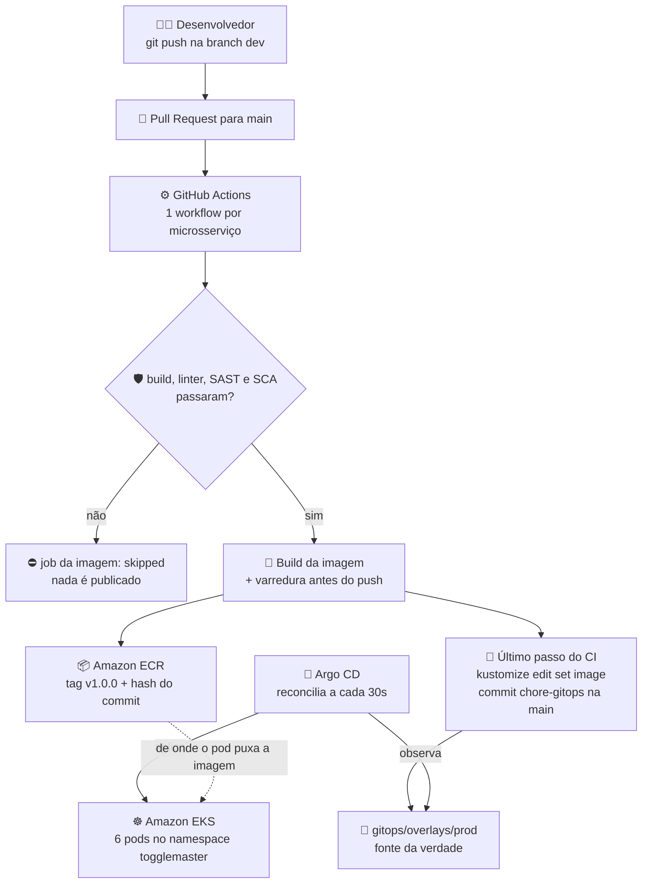
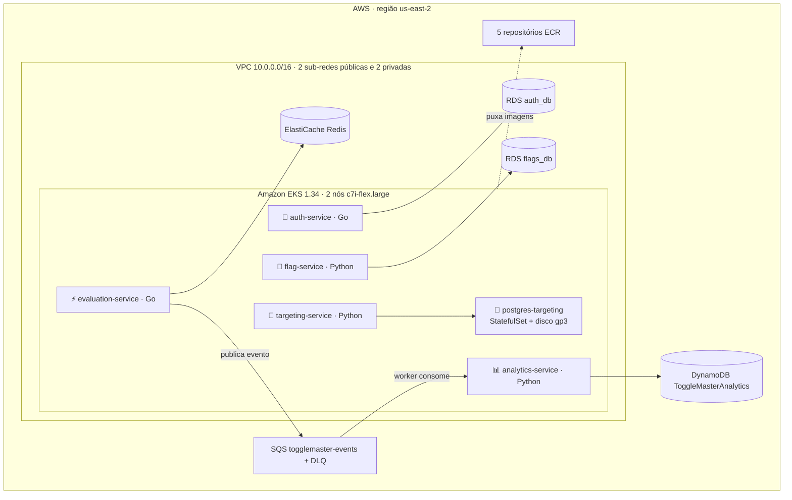
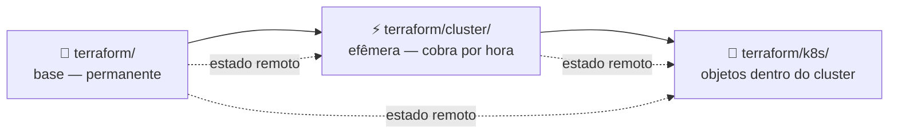
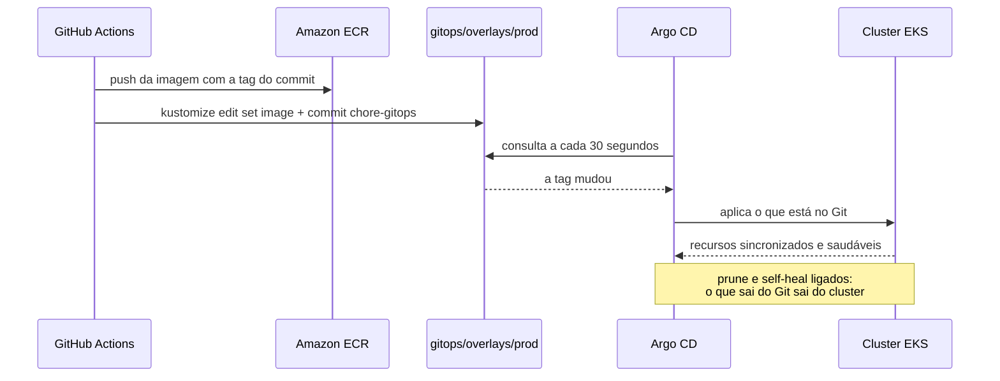

<div align="center">

# 🚩 ToggleMaster — Fase 3

### Infraestrutura como Código, CI/CD, DevSecOps e GitOps

*A mesma plataforma de feature flags da Fase 2 — só que agora nada nasce de um clique no console, e ninguém dá deploy pela própria máquina.*

[](https://www.terraform.io/)
[](https://github.com/features/actions)
[](https://trivy.dev/)
[](https://argo-cd.readthedocs.io/)
[](https://kubernetes.io/)
[](https://aws.amazon.com/)

---

**Tech Challenge — Fase 3 | POSTECH FIAP | Grupo 203**

<!-- ANTES DE PUBLICAR: trocar PREENCHER_URL_DO_VIDEO pela URL do vídeo no YouTube,
     e preencher o mesmo link em docs/RELATORIO_DE_ENTREGA.md. -->

[🎥 Vídeo da entrega](PREENCHER_URL_DO_VIDEO) · [📄 Relatório preliminar](./docs/RELATORIO_DE_ENTREGA.md) · [🗂️ PDF preliminar](./output/pdf/RELATORIO_ENTREGA_FIAP_FASE3_GRUPO203_2026-09-14_v01_PRELIMINAR.pdf) · [📋 Enunciado](./docs/POSTECH%20-%20Tech%20Challenge%20-%20Fase%203.pdf) · [🏗️ Terraform](./terraform/) · [⚙️ Pipelines](./.github/workflows/) · [☸️ GitOps](./gitops/) · [📦 Fase 2](https://github.com/fiap-devops-arqcloud-2026/tech-challenge-02)

</div>

---

> **Estado verificado em 2026-09-14:** a infraestrutura foi aplicada e observada em 2026-09-11 e depois desmontada para encerrar os custos. O código e as evidências históricas permanecem no repositório. A entrega ainda depende do vídeo e da liberação de acesso ao avaliador.

## 📑 Índice

- [O problema que a Fase 3 resolve](#-o-problema-que-a-fase-3-resolve)
- [O que mudou da Fase 2 para cá](#-o-que-mudou-da-fase-2-para-cá)
- [Arquitetura](#️-arquitetura)
- [Infraestrutura como código](#-infraestrutura-como-código)
- [O pipeline de CI e DevSecOps](#️-o-pipeline-de-ci-e-devsecops)
- [GitOps e Argo CD](#-gitops-e-argo-cd)
- [Segurança](#-segurança)
- [Pré-requisitos](#-pré-requisitos)
- [Como reproduzir](#-como-reproduzir)
- [Provando que a esteira funciona](#-provando-que-a-esteira-funciona)
- [Problemas enfrentados e como resolvemos](#️-problemas-enfrentados-e-como-resolvemos)
- [Escopo e desvios conscientes](#️-escopo-e-desvios-conscientes)
- [Custo](#-custo)
- [Estrutura do repositório](#-estrutura-do-repositório)
- [Time](#-time)

---

## 💡 O problema que a Fase 3 resolve

Imagine uma equipe que já tem o sistema no ar. Funciona. Os usuários usam. E, ainda assim, ninguém dorme tranquilo — porque **o ambiente que sustenta esse sistema existe só na memória de quem o criou**. O cluster foi montado clicando no console. O banco também. As filas, idem. Se aquilo tudo cair numa sexta-feira à noite, remontar leva dias, e provavelmente sai diferente.

Era exatamente a situação em que a Fase 2 deste projeto terminou: o ToggleMaster rodando na AWS, mas colocado lá **na mão**.

O enunciado da Fase 3 descreve essa dor em quatro sintomas bem concretos, e cada um tem uma resposta neste repositório:

| Sintoma descrito no enunciado | A resposta aqui |
|---|---|
| *"Os desenvolvedores estão rodando `kubectl apply` de suas máquinas locais, gerando conflitos de versão"* | **GitOps com Argo CD.** Ninguém aplica nada: o Git é a fonte da verdade e o cluster se ajusta sozinho ao que está escrito lá |
| *"As credenciais do banco de dados estão sendo passadas em arquivos de texto sem segurança"* | **Nenhum segredo versionado.** As senhas são geradas pelo Terraform; o CI entra na AWS por identidade federada e os pods por identidade de conta de serviço — sem chave estática em lugar nenhum |
| *"Recentemente, uma vulnerabilidade em uma biblioteca Go passou despercebida e foi para produção"* | **Pipeline DevSecOps.** Análise de dependências, análise estática e varredura da imagem. Vulnerabilidade crítica **impede a imagem de ser construída** |
| *"Recriar o ambiente de homologação leva dias porque foi feito manualmente no console"* | **Terraform.** Um comando levanta tudo, outro apaga tudo, e o resultado é igual todas as vezes |

A frase que organiza a fase inteira é simples: **"se não está no código, não existe"**.

> 💡 **E o que é o ToggleMaster?** Uma plataforma de *feature flags* — interruptores que ligam e desligam funcionalidades de um aplicativo em tempo real, sem novo deploy. São cinco microsserviços: `auth`, `flag`, `targeting`, `evaluation` e `analytics`. A aplicação em si é herança da Fase 2 e não é o entregável desta fase; a explicação completa dela está no [repositório da Fase 2](https://github.com/fiap-devops-arqcloud-2026/tech-challenge-02).

---

## 🔁 O que mudou da Fase 2 para cá

Na Fase 2, a seção *Melhorias futuras* do README era uma promessa: *"hoje a gente cria o cluster, os bancos, os repositórios de imagem e as filas clicando no console da AWS; com o Terraform, tudo isso vira texto"*. Esta fase é essa promessa cumprida, linha por linha.

| O que | Fase 2 — na mão | Fase 3 — automatizado |
|---|---|---|
| Montar o ambiente | Dezenas de cliques no console, e cada pessoa monta de um jeito 😰 | `terraform apply` em três camadas, reproduzível ✅ |
| Derrubar no fim do dia | Apagar node group, bancos, cache e rede um por um 😱 | `terraform destroy` da camada que cobra por hora ✅ |
| Publicar uma versão nova | Alguém lembra de construir e enviar as cinco imagens 🤯 | Nasce sozinho do `git push` ✅ |
| Levar a versão ao cluster | `kubectl apply` do notebook de quem estava com o terminal aberto 😵 | Ninguém aplica: o Argo CD reconcilia o que está no Git ✅ |
| Credenciais da AWS | Chave estática dentro de um Secret e nos segredos do GitHub | Identidade federada no CI e identidade de conta de serviço nos pods ✅ |
| Biblioteca com falha crítica | Só se alguém reparasse | O pipeline barra **antes** de a imagem existir ✅ |
| Disco do banco em pod | Travava esperando alguém configurar a classe de armazenamento | Classe `gp3` e driver de disco nascem do Terraform ✅ |

A aplicação não mudou. **O que mudou é tudo que está em volta dela.**

---

## 🏗️ Arquitetura

### A esteira, do commit ao pod

Este é o diagrama que define a fase. Repare que **não existe seta saindo de uma máquina de desenvolvedor para o cluster** — esse caminho foi removido de propósito.



> ⚠️ **A regra que mais vale nota está no losango.** O job que constrói a imagem depende dos quatro jobs de qualidade e segurança. Se qualquer um falha, ele **não é agendado** — aparece como `skipped` na interface do GitHub. A imagem vulnerável nunca chega a existir, quanto mais a ser publicada.

### O que roda na AWS



Tudo isso — rede, cluster, nós, bancos, cache, fila, tabela, repositórios de imagem e as permissões IAM — nasce de `terraform apply`. O detalhamento da arquitetura, com o mapa das camadas e a postura de segurança, está em [`docs/ARQUITETURA.md`](./docs/ARQUITETURA.md).

> ℹ️ **Não há Ingress nem Load Balancer.** Os serviços conversam entre si dentro do cluster; o acesso externo, quando necessário, é por `kubectl port-forward`. O porquê está em [escopo e desvios conscientes](#️-escopo-e-desvios-conscientes).

---

## 🧱 Infraestrutura como código

O Terraform está dividido em **três camadas com estados independentes**, todas no mesmo bucket do S3. Essa divisão não é estética: ela existe porque o ambiente é efêmero, e um estado único destruiria os repositórios de imagem junto com o cluster toda vez que a conta fosse desligada.



### 🧱 `terraform/` — O Alicerce

**Estado:** `prod/base.tfstate` · **Ciclo:** permanente · **Custo com o NAT desligado:** próximo de zero

Rede e tudo que precisa sobreviver entre uma sessão e outra: VPC `10.0.0.0/16` com duas sub-redes públicas e duas privadas em zonas diferentes, os cinco repositórios ECR (varredura no push, criptografia AES256, retenção das dez últimas imagens), a fila SQS `togglemaster-events` com sua fila de mensagens mortas, a tabela DynamoDB `ToggleMasterAnalytics` sob demanda, e a federação de identidade que permite ao GitHub Actions entrar na conta sem chave.

É aqui que ficam as imagens já publicadas. Por isso esta camada **nunca é destruída**.

### ⚡ `terraform/cluster/` — O Motor

**Estado:** `prod/cluster.tfstate` · **Ciclo:** sobe para a sessão, é destruída ao fim · **Custo:** é esta camada que aparece na fatura

Cluster EKS **1.34** com endpoint público e privado, node group de dois `c7i-flex.large` (mínimo 1, desejado 2, máximo 4) e cinco addons gerenciados, incluindo o driver de disco EBS e o coletor de métricas. Mais duas instâncias RDS PostgreSQL 16 `db.t3.micro` com 20 GB criptografados e sem acesso público, uma instância ElastiCache Redis `cache.t3.micro`, e as duas permissões de conta de serviço que dão acesso à fila e à tabela.

### 🔐 `terraform/k8s/` — O Cofre e o Sincronizador

**Estado:** `prod/k8s.tfstate` · **Ciclo:** acompanha a camada do meio

O que vive *dentro* do cluster: o namespace, os cinco Secrets com senhas geradas na hora, a classe de armazenamento `gp3` criptografada, e o Argo CD instalado por Helm (chart fixado na versão `7.7.11`) junto com a Application que aponta para a pasta GitOps.

> ⚠️ **O primeiro `apply` desta camada são dois comandos, não um.** O recurso que cria a Application valida o tipo dela contra o cluster ainda no planejamento, e esse tipo só existe depois que o Argo CD é instalado. A ordem está explicada em [como reproduzir](#-como-reproduzir).

### Decisões que valem para as três

| Decisão | Por quê |
|---|---|
| Estado remoto no S3 com **bloqueio nativo por arquivo de lock** | Dispensa a tabela DynamoDB que a abordagem antiga exigia. Requer Terraform 1.11 ou superior — o CI usa a 1.16.0 |
| **7 módulos próprios** (`ecr`, `eks`, `elasticache`, `iam-ci`, `irsa`, `messaging`, `rds`) e **um único módulo da comunidade**, o de VPC | Rede tem armadilha demais para escrever do zero; o resto é simples e ficou autoral, o que torna o código legível na correção |
| Restrição do provider AWS como `>= 5.46`, **sem teto**, com `.terraform.lock.hcl` versionado | Um teto rígido conflitava com a restrição interna do módulo de VPC. A reprodutibilidade fica no arquivo de lock, que é o lugar dela |
| Etiquetas `project = fiap` e `phase = 3`, **em minúsculas**, aplicadas uma vez só pela configuração padrão do provider | A chave de etiqueta na AWS diferencia maiúscula de minúscula: divergir partiria o relatório de custos em dois grupos |

→ [Ver a documentação completa das camadas](./terraform/README.md)

---

## 🛡️ O pipeline de CI e DevSecOps

São **nove workflows**: cinco chamadores (um por microsserviço), dois reutilizáveis (um para Go, outro para Python), um que valida o Terraform e um que roda o teste de integração com Docker Compose.

Cada pipeline de serviço dispara em `push` nas branches `main` e `dev`, em Pull Request para qualquer uma das duas, e manualmente. Os filtros de caminho garantem que só o serviço alterado roda — e, de propósito, **`gitops/**` não está na lista de gatilhos**, o que impede o commit automático de tag de disparar o pipeline de novo, em laço.

### Os seis jobs

| Job | Go (`auth`, `evaluation`) | Python (`flag`, `targeting`, `analytics`) |
|---|---|---|
| **Build e testes** | `go build -v ./...` e `go test -count=1 -v ./...` | `python -m compileall -q .` e busca por suíte em `tests/` |
| **Linter** | golangci-lint `v2.13.2` | flake8 (erros de sintaxe bloqueiam; estilo é informativo) e pylint com `.pylintrc` versionado |
| **SAST** | gosec `v2.29.0`, com `-severity high -confidence medium` | bandit `-r . -ll` |
| **SCA** | Trivy no código-fonte do serviço | idem |
| **Imagem** | build multi-stage, varredura, e só então push no ECR | idem |
| **GitOps** | grava a tag nova no overlay e comita | idem |

> ⚠️ **Honestidade sobre os testes:** o passo existe e roda, mas **hoje não há nenhum arquivo de teste unitário no repositório** — nenhum `*_test.go`, nenhum `test_*.py`. O job de build compila e, no caso do Python, avisa que não encontrou suíte. O que existe de verificação automatizada de comportamento é o teste de integração ponta a ponta em `scripts/integration/`, disparado pelo workflow `compose-integration.yml`. A lacuna de teste unitário está listada em [escopo e desvios conscientes](#️-escopo-e-desvios-conscientes) como lacuna assumida, não como capacidade entregue.

### A regra de bloqueio — o coração da fase

O bloqueio não é um script que interpreta saída de ferramenta. É uma dependência declarada entre jobs, e é isso que o torna à prova de descuido:

```yaml
  image:
    name: Imagem Docker e push no ECR
    # Os quatro jobs de qualidade e segurança precisam ter terminado com sucesso.
    # Se UM falhar, este job nem chega a ser agendado: aparece como "skipped".
    needs: [build, lint, sast, sca]
    # E mesmo passando, só publica no push para a main — PR não publica imagem.
    if: github.event_name == 'push' && github.ref == 'refs/heads/main'
```

```yaml
  gitops:
    name: Atualizar tag no GitOps
    # Sem imagem publicada não existe tag nova para escrever no overlay.
    needs: [image]
    # Mesma trava do job anterior: o overlay que o Argo CD lê vive na main.
    if: github.event_name == 'push' && github.ref == 'refs/heads/main'
```

O efeito em cadeia é: **falha de segurança → sem imagem → sem tag nova → o cluster continua na versão anterior**. O caminho até produção fecha sozinho.

### Como o Trivy está configurado

Cada pipeline roda duas varreduras do Trivy — uma no código-fonte, outra na imagem — com a mesma configuração:

```yaml
      # Action fixada pelo hash do commit, não por tag: uma tag pode ser movida
      # por baixo do pipeline; um hash, não.
      uses: aquasecurity/trivy-action@ed142fd0673e97e23eac54620cfb913e5ce36c25 # v0.36.0
      with:
        severity: CRITICAL        # só o que é crítico derruba o build
        exit-code: "1"            # achou crítico, o job falha de verdade
        ignore-unfixed: false     # falha sem correção publicada TAMBÉM conta
        trivyignores: .trivyignore
```

A varredura da imagem acontece **antes de qualquer `docker push`**: o job constrói localmente com a tag `:scan`, varre, e só depois faz o login federado e envia. Uma imagem reprovada nunca chega ao registro.

> 💡 **Por que `ignore-unfixed: false`?** Ligar essa opção apagaria, em silêncio e para sempre, uma classe inteira de achados — inclusive os futuros. Em vez disso, as exceções são nominais: o [`.trivyignore`](./.trivyignore) tem **exatamente três CVEs**, todos do pacote `perl-base` da imagem base do Python, cada um com justificativa escrita e data de revisão. Qualquer crítico fora dessa lista continua derrubando o pipeline, e cada exceção nova aparece no diff de um Pull Request.

### A prova de que o controle não é decorativo

Quando a regra foi implementada ao pé da letra, o pipeline **quebrou na hora**: o Trivy acusou o `CVE-2026-56854`, crítico, na biblioteca `golang.org/x/crypto` v0.20.0, dependência do `auth-service`. A vulnerabilidade estava no projeto havia semanas, publicada e invisível, porque os passos de varredura eram tolerantes a falha e apenas imprimiam o achado.

A biblioteca foi atualizada para a v0.55.0 e o pipeline voltou ao verde. Fica o aprendizado, que vale mais que o conserto: **pipeline verde não prova que o código é seguro — prova que ninguém configurou o pipeline para reclamar.**

---

## 🔄 GitOps e Argo CD

O princípio: **o cluster não recebe ordens, ele persegue um estado escrito**. O que está em `gitops/overlays/prod` na branch `main` é o que deve existir no cluster. Se alguém alterar um objeto à mão, o Argo CD desfaz.



### O que está declarado

`kubectl kustomize gitops/overlays/prod` renderiza **23 objetos**: 6 Services, 6 ConfigMaps, 5 Deployments, 2 ServiceAccounts, 2 HorizontalPodAutoscalers, 1 StatefulSet e 1 Namespace. Os cinco serviços sobem com uma réplica; os dois que têm escala automática — `evaluation` e `analytics` — vão de 1 a 2 réplicas a 70% de CPU. Todos os pods têm sondas de prontidão e de vida em `/health`; o banco em pod é verificado com `pg_isready`.

Há **um único overlay**, chamado `prod`. Ele guarda as três coisas que dependem do ambiente: as tags das imagens, os endereços do Redis e da fila, e as anotações de identidade dos dois serviços que falam com a AWS.

### Como a tag chega ao Git sem um humano no meio

O último job do pipeline não faz `sed` em YAML nem `git pull --rebase` — as duas coisas quebraram na prática, com cinco pipelines escrevendo no mesmo arquivo ao mesmo tempo. O que existe hoje é um laço de até cinco tentativas que, a cada volta:

```bash
git fetch origin main                     # busca o estado mais recente
git reset --hard origin/main              # descarta a tentativa anterior por inteiro
kustomize edit set image "<serviço>=<registro>/<serviço>:<tag>"   # reescreve UMA linha
git diff --quiet && exit 0                # se já está igual, nada a fazer
git commit -m "chore(gitops): <serviço> para <tag> [skip ci]"
git push origin HEAD:main                 # se for rejeitado, espera e recomeça
```

Sem merge não existe conflito possível, e a operação passa a ser idempotente. Os cinco commits automáticos saem limpos na mesma execução.

### O Argo CD

Instalado pelo Terraform via Helm, com o chart fixado em `7.7.11` e o supérfluo desligado (autenticação externa, gerador de Applications e notificações ficam fora). A Application `togglemaster` aponta para `gitops/overlays/prod` na branch `main`, com sincronização automática, `prune` e `selfHeal` ligados, e nova tentativa com espera progressiva em caso de falha.

Um detalhe que costuma passar batido: o intervalo de reconciliação foi baixado de 180 para **30 segundos**. Como não há Ingress nem Load Balancer, não existe webhook do GitHub chegando no Argo CD — ele descobre a mudança perguntando, e perguntar de meio em meio minuto é o que torna a demonstração assistível.

→ [Ver a documentação do GitOps](./gitops/README.md) · [Contrato de Secrets entre Terraform e manifestos](./gitops/SECRETS-CONTRATO.md)

---

## 🔐 Segurança

O enunciado reclama de credenciais em arquivo de texto. A resposta deste projeto é mais radical que guardar melhor: **não existe chave estática da AWS em lugar nenhum** — nem no repositório, nem nos segredos do GitHub, nem dentro do cluster.

| Onde | Como se autentica | Escopo |
|---|---|---|
| **GitHub Actions → AWS** | Identidade federada (OIDC). A política de confiança só aceita pedidos vindos deste repositório | Push apenas nos ARNs dos cinco repositórios ECR — não é `ecr:*` na conta |
| **Pods → AWS** | Identidade de conta de serviço (IRSA), com credencial temporária | `evaluation` só publica na fila; `analytics` só consome da fila e escreve na tabela. Sem curinga em nenhuma das duas |

### Onde ficam os segredos

| Segredo | Onde nasce | Onde vive |
|---|---|---|
| Senhas das duas instâncias RDS | Geradas na camada `cluster` | Guardadas no AWS Secrets Manager e, em paralelo, entregues aos Secrets do namespace pela camada `k8s` |
| Senha do banco em pod, 24 caracteres | Gerada na camada `k8s` | Secret do Kubernetes |
| `MASTER_KEY`, 32 caracteres | Gerada na camada `k8s` | Secret do Kubernetes |
| `SERVICE_API_KEY`, 32 caracteres | Valor de bootstrap na camada `k8s` | Secret marcado para **ignorar alterações**, para não brigar com o valor real definido na carga inicial |

### Criptografia ligada explicitamente

Estado do Terraform no S3, imagens no ECR, fila e fila de mensagens mortas, tabela DynamoDB, discos das instâncias RDS, cache em repouso e a classe de armazenamento `gp3` do cluster.

> ⚠️ **Uma exceção honesta:** a criptografia **em trânsito** do Redis está desligada por padrão. Ligá-la sem trocar o endereço de `redis://` para `rediss://` derruba o `evaluation-service` na inicialização. Há uma variável pronta para ativar as duas coisas juntas; enquanto isso, o tráfego fica dentro da VPC, em sub-rede privada, liberado só pelo grupo de segurança do cluster.

A política de segurança do repositório está em [`SECURITY.md`](./SECURITY.md).

---

## 📋 Pré-requisitos

| Ferramenta | Versão | Para quê |
|---|---|---|
| [Terraform](https://developer.hashicorp.com/terraform/downloads) | 1.11 ou superior | O bloqueio de estado por arquivo de lock exige essa versão. O CI usa 1.16.0 |
| [AWS CLI](https://aws.amazon.com/cli/) | v2 | Autenticar e apontar o `kubectl` para o cluster |
| [kubectl](https://kubernetes.io/docs/tasks/tools/) | compatível com 1.34 | Conferir o cluster e renderizar os manifestos |
| [Docker](https://www.docker.com/products/docker-desktop/) | Desktop atual, com Compose v2 | Só se você quiser rodar a aplicação localmente |
| Conta AWS própria | — | Região `us-east-2` (Ohio). Não é conta de laboratório acadêmico |
| Bucket de estado | — | `togglemaster-tfstate-891376952395-us-east-2-an`, criado uma única vez fora do Terraform |

> ⚠️ **Isto custa dinheiro de verdade.** Diferente da Fase 2, aqui `terraform apply` cria um cluster EKS, dois bancos gerenciados, um cache e um NAT Gateway. Com tudo de pé, são cerca de **US$ 0,385 por hora**. Não suba a camada do cluster sem ler [custo](#-custo) e sem se comprometer com o `terraform destroy` no fim. O passo 7 de [como reproduzir](#-como-reproduzir) não é opcional.

> 💡 **Quer só ver a aplicação funcionando, sem AWS?** Dá, e não é preciso nenhuma credencial real:
>
> *Linux / macOS:*
> ```bash
> cp .env.example .env
> docker compose up --build -d
> ```
>
> *Windows (PowerShell):*
> ```powershell
> Copy-Item .env.example .env
> docker compose up --build -d
> ```
>
> Isso sobe os cinco serviços, os bancos PostgreSQL, o Redis e o DynamoDB Local. **A fila fica desativada neste modo** — o `.env.example` entrega `AWS_SQS_URL` vazia de propósito. Para exercitar também a fila, existe um simulador completo, descrito em [`docs/OPERACAO.md`](./docs/OPERACAO.md) e em [provando que a esteira funciona](#-provando-que-a-esteira-funciona).

---

## 🚀 Como reproduzir

A ordem importa: cada camada lê o estado da anterior.

**Passo 0 — o bucket de estado, uma única vez**

Ele não pode ser criado pelo próprio Terraform, porque é onde o Terraform guarda o estado. O passo a passo está em [`terraform/BOOTSTRAP-BACKEND-S3.md`](./terraform/BOOTSTRAP-BACKEND-S3.md).

**Passo 1 — autentique-se na conta**

*Linux / macOS:*
```bash
export AWS_PROFILE=togglemaster        # perfil configurado no aws configure
aws sts get-caller-identity            # confirma em qual conta você está
```

*Windows (PowerShell):*
```powershell
$env:AWS_PROFILE = "togglemaster"      # perfil configurado no aws configure
aws sts get-caller-identity            # confirma em qual conta você está
```

**Passos 2 a 7 — as camadas, na ordem**

```bash
# 2. CAMADA BASE — permanente, custo próximo de zero com o NAT desligado.
#    Cria VPC, os 5 repositórios ECR, a fila SQS com a DLQ, a tabela
#    DynamoDB e a federação de identidade do CI.
terraform -chdir=terraform init
terraform -chdir=terraform apply

# 3. CAMADA CLUSTER — efêmera. É ELA que cobra por hora.
#    Cria EKS, node group, as 2 instâncias RDS, o Redis e as permissões
#    de conta de serviço. Leva de 20 a 40 minutos.
terraform -chdir=terraform/cluster init
terraform -chdir=terraform/cluster apply

# 4. Aponte o kubectl para o cluster recém-criado.
aws eks update-kubeconfig --name togglemaster --region us-east-2

# 5. CAMADA K8S — SÃO DOIS COMANDOS, e isso é proposital.
#    O primeiro instala o Argo CD e, com ele, o tipo "Application".
#    O segundo cria o restante, inclusive a Application em si — que só
#    pode ser planejada depois que o tipo dela existe no cluster.
terraform -chdir=terraform/k8s init
terraform -chdir=terraform/k8s apply -target=helm_release.argocd
terraform -chdir=terraform/k8s apply

# 6. A partir daqui não se aplica mais nada à mão: o Argo CD assume.
#    Confira o que ele vai encontrar no Git antes de ele encontrar.
kubectl kustomize gitops/overlays/prod

# 7. AO TERMINAR — DESTRUTIVO. Apaga cluster, nós, bancos e cache desta
#    camada, com os dados dentro deles. Preserva os repositórios de
#    imagem e tudo que já foi publicado neles, que vivem na camada base.
terraform -chdir=terraform/cluster destroy
```

> ⚠️ **O NAT Gateway mora na camada base, que nunca é destruída.** Esquecido ligado, ele sozinho custa cerca de **US$ 33 por mês**. Existe a variável `enable_nat_gateway` justamente para isso: deixe-a como `false` fora das sessões de trabalho, e como `true` só enquanto o cluster estiver de pé.

O guia operacional completo — subir, criar os esquemas dos bancos, semear dados, demonstrar e desligar — está em [`docs/OPERACAO.md`](./docs/OPERACAO.md).

### Antes de abrir um Pull Request

```bash
# Reproduz localmente o essencial do que o CI faz: varredura de segredos,
# fmt e validate nas três camadas do Terraform, render do Kustomize,
# checagem de sintaxe dos 3 serviços Python e build + testes dos 2 em Go.
# O script pula, com aviso, qualquer etapa cuja ferramenta não esteja
# instalada. Erro barato pego aqui economiza uma volta inteira de pipeline.
bash scripts/validate-all.sh
```

### Fluxo de trabalho no Git

Todo trabalho humano parte da branch `dev` e chega à `main` por Pull Request. Existe **uma única exceção**, e ela é deliberada: o commit automático que atualiza a tag da imagem vai direto para a `main`, porque é de lá que o Argo CD lê o estado desejado. Fazer o robô abrir Pull Request para si mesmo criaria uma fila de aprovações no meio do caminho crítico do GitOps.

A consequência prática é que **a `main` anda sozinha**. Sincronize antes de começar:

```bash
git switch dev
git fetch origin
git merge --ff-only origin/main     # traz os commits automáticos de tag
```

---

## 🧪 Provando que a esteira funciona

O que se pode verificar sem subir nada:

```bash
# 1. Os manifestos renderizam? Devem sair 23 objetos.
kubectl kustomize gitops/overlays/prod | grep -c "^kind:"
```
```
23
```

```powershell
# Windows (PowerShell) — mesma verificação
(kubectl kustomize gitops/overlays/prod | Select-String "^kind:").Count
```

```bash
# 2. O robô do CI realmente escreve no repositório?
git log --all --oneline --grep "chore(gitops)" | wc -l
```
```
21
```

> ℹ️ Esse número é uma fotografia do momento em que este texto foi escrito, e **cresce sozinho**: cada push na `main` que gera imagem nova acrescenta um commit automático. O que importa não é o total, e sim que ele seja maior que zero e que o autor de cada um desses commits seja `github-actions[bot]`.

```bash
# 3. O overlay aponta para imagens imutáveis, com o hash do commit?
grep "newTag" gitops/overlays/prod/kustomization.yaml
```
```
  newTag: v1.0.0-ff441a1
  newTag: v1.0.0-7ab0602
  newTag: v1.0.0-7ab0602
  newTag: v1.0.0-9712392
  newTag: v1.0.0-ff441a1
```

> 💡 **As cinco tags não são iguais, e isso é o comportamento correto.** Cada serviço tem seu próprio pipeline, disparado só quando a pasta dele muda. Um serviço que não mudou não ganha imagem nova — continua na versão que já estava validada.

```bash
# 4. A aplicação inteira funciona ponta a ponta, sem nenhuma conta AWS?
#    Sobe os 5 serviços, os bancos, o Redis e o Moto — simulador local de
#    SQS e DynamoDB — e executa o fluxo completo: login, criação de flag,
#    regra de segmentação, avaliação, cache com TTL, evento na fila e
#    gravação na tabela.
#    Requer Linux ou WSL, Docker Compose v2 e Python 3.
#    Usa as portas 8000-8005, 5433, 5434 e 6379.
bash scripts/test-compose.sh
```

O script **não derruba o ambiente no fim**, de propósito: com os containers de pé você consegue inspecionar logs e bancos depois que o teste passa. Para encerrar e descartar **somente** os dados desse projeto de teste (o `-v` apaga os volumes):

```bash
docker compose --env-file .env.example -p tc03-integration \
  -f docker-compose.yaml -f docker-compose.integration.yaml down -v
```

Com o cluster no ar, a verificação é o próprio Argo CD:

```bash
kubectl get applications -n argocd
```

Saída esperada:

```
NAME           SYNC STATUS   HEALTH STATUS
togglemaster   Synced        Healthy
```

```bash
# Seis pods: os cinco microsserviços e o banco do targeting.
kubectl get pods -n togglemaster
```

A lista de evidências que aparecem no vídeo e no relatório está em [`docs/RELATORIO_DE_ENTREGA.md`](./docs/RELATORIO_DE_ENTREGA.md).

---

## ⚠️ Problemas enfrentados e como resolvemos

### 1. O pipeline passava verde escondendo uma vulnerabilidade real

Os cinco pipelines vinham verdes, mas os passos de varredura eram tolerantes a falha: imprimiam o achado e devolviam sucesso. Ao implementar a regra de bloqueio ao pé da letra, o Trivy acusou uma vulnerabilidade crítica na biblioteca `golang.org/x/crypto`, usada pelo `auth-service`, que estava no projeto havia semanas.

**Como resolvemos:** tolerância a falha removida e o job da imagem passou a depender dos quatro jobs de qualidade. A biblioteca foi atualizada. O aprendizado vale mais que o conserto — pipeline verde prova que ninguém configurou o pipeline para reclamar.

### 2. Corrigir uma dependência arrastou o toolchain inteiro

A atualização da biblioteca elevou a versão de Go declarada nos módulos e quebrou três coisas em sequência: o Dockerfile, a versão fixada no job de análise estática, e o linter, que se recusa a analisar um módulo compilado com versão maior que a dele.

**Como resolvemos:** Dockerfiles, job de segurança e linter atualizados juntos. A lição prática: uma atualização de segurança arrasta a versão da linguagem, e **todo lugar que fixa versão precisa ser revisado no mesmo commit**.

### 3. Três vulnerabilidades críticas sem correção publicada na imagem base

Com o rigor literal, a varredura passou a acusar três falhas críticas no pacote `perl-base` da imagem base do Python. Nenhuma tem correção publicada, e o pacote é essencial — remover quebra a imagem.

**Como resolvemos:** em vez de ligar a opção que ignora achados sem correção — o que apagaria uma classe inteira de alertas, em silêncio e para sempre —, registramos os três nominalmente no `.trivyignore`, com justificativa individual e data de revisão. Antes de mudar qualquer coisa, o efeito foi **medido nas imagens reais**: a imagem base dos serviços em Go não traz nenhum crítico, e por isso não tem exceção nenhuma.

### 4. Um estado único do Terraform apagaria as imagens junto com o ambiente

Como o ambiente é destruído ao fim de cada sessão, um `destroy` levaria junto os cinco repositórios de imagem — e, com a exclusão forçada ligada, as imagens já publicadas. O CI teria de reconstruir tudo antes de cada sessão.

**Como resolvemos:** três camadas com estados independentes. Só a que cobra por hora sobe e desce.

### 5. A conta recusou o terceiro banco e o tipo de máquina planejado

Duas recusas da API, não alertas de orçamento. A terceira instância RDS voltou com `maximum number of instances available with free plan accounts`; o `t3.medium` previsto para os nós voltou com `The specified instance type is not eligible for Free Tier`. Descer para a máquina menor não era saída: cabem cerca de quatro pods por nó, contando os componentes do próprio Kubernetes.

**Como resolvemos:** duas instâncias ficaram no serviço gerenciado e o terceiro banco roda como StatefulSet dentro do cluster, com disco persistente — mesmo arranjo da Fase 2, confirmado com o professor. Os nós passaram a usar `c7i-flex.large`, equivalente direto e aceito pela conta, com o dimensionamento feito medindo os recursos reais pedidos pelos cinco serviços.

### 6. A versão do Kubernetes escolhida custava seis vezes mais

O planejamento apontava a versão 1.31, que era o padrão do módulo. Uma consulta à API mostrou que ela já havia saído do suporte padrão — o que leva o control plane de **US$ 0,10/h para US$ 0,60/h**, sem nenhum ganho para o projeto.

**Como resolvemos:** subimos para a **1.34**, em suporte padrão até dezembro de 2026. Valor padrão de módulo envelhece, e nesse caso o preço envelhece junto.

### 7. O Terraform não conseguia instalar o Argo CD de primeira

O recurso que cria a Application valida o tipo dela contra o cluster ainda no planejamento — mas esse tipo só passa a existir depois que o Argo CD é instalado, o que acontece na aplicação. Declarar dependência entre recursos não resolve, porque o problema é de ordem entre planejar e aplicar.

**Como resolvemos:** o primeiro `apply` dessa camada é documentado em duas etapas. Duas alternativas foram avaliadas e descartadas: trazer um provider de terceiros para o projeto, e criar a Application fora do Terraform — o que tiraria do código justamente o objeto que demonstra o GitOps.

### 8. Cinco pipelines gravando no mesmo arquivo se atropelaram

O bloco de concorrência do GitHub não enfileira: mantém um em execução e um pendente, cancelando o pendente anterior a cada novo. E a estratégia de `rebase` conflitava no arquivo de tags, deixando o repositório travado no meio de um rebase.

**Como resolvemos:** o laço que busca, descarta, reescreve e empurra a cada tentativa. Sem merge não há conflito possível.

### 9. Um merge resolvido "escolhendo um lado" apagou código em silêncio

Uma implementação paralela na branch principal tinha os mesmos nomes de arquivo dos nossos workflows. Resolver os trinta arquivos conflitantes dando prioridade a um dos lados descartou, sem aviso, o que o outro lado tinha de exclusivo: o suporte aos endpoints locais de fila e de tabela.

**Como resolvemos:** a perda apareceu porque o teste de integração ficou vermelho logo em seguida, e o suporte foi restaurado no commit seguinte. Antes do merge havia sido criada uma tag de backup no remoto, o que tornava o erro reversível. **Quem mostra o que sumiu é o teste, não o diff.**

### 10. "Está escrito" não é o mesmo que "funciona"

Uma revisão encontrou falhas que o acompanhamento não mostrava, porque itens escritos estavam marcados igual a itens comprovados. Ao cortar do plano o operador que sincronizaria os segredos, o código substituto nunca foi escrito: os cinco Secrets referenciados pelos pods não eram criados por nada, e todos os serviços subiriam com erro de configuração de container.

**Como resolvemos:** os Secrets passaram a nascer de um arquivo Terraform próprio, o Argo CD virou código de verdade, e o acoplamento invisível entre as duas partes virou um [contrato escrito de nomes e chaves](./gitops/SECRETS-CONTRATO.md).

### Os menores, em uma linha cada

| O que aconteceu | Como resolvemos |
|---|---|
| `kubectl kustomize` renderiza, mas não tem o subcomando `edit` que o CI usa | O runner instala o binário `kustomize` autônomo antes desse passo |
| Uma versão da action de varredura nunca foi publicada; uma versão do analisador estático não compilava com o toolchain atual | Action fixada por hash de commit; analisador atualizado e com a versão de linguagem fixada no job |
| Etiquetas com caixa diferente partiriam o relatório de custos em dois grupos | `project` e `phase` em minúsculas, aplicadas uma vez só pela configuração padrão do provider |
| O disco do banco em pod travava esperando uma classe de armazenamento padrão | Driver de disco e classe `gp3` nascem do Terraform, e o StatefulSet pede a classe pelo nome |
| Teto rígido no provider AWS conflitava com o módulo de rede da comunidade | Restrição sem teto e reprodutibilidade garantida pelo arquivo de lock versionado |
| Analisadores reprovaram os cinco serviços na primeira execução | Achados reais corrigidos no código; falsos positivos com exceção pontual e justificativa na própria linha; nota do analisador subiu de 4,84–5,66 para 7,59–8,26 |
| Documentação herdada mandava cadastrar chave estática da AWS nos segredos do GitHub | Reescrita: é exatamente a prática que esta fase eliminou |

---

## ⚖️ Escopo e desvios conscientes

Esta seção existe para o avaliador não precisar caçar o que falta: o escopo está delimitado, e cada desvio tem motivo verificável.

**Legenda:** ✅ entregue · 🟡 desvio consciente, com justificativa · 💡 fora do escopo desta fase

| Item | Situação | Justificativa |
|---|---|---|
| Infraestrutura inteira em Terraform, estado remoto | ✅ | Três camadas, sete módulos próprios, estado no S3 com bloqueio |
| Workflow por microsserviço com build, linter, SAST, SCA e varredura de imagem | ✅ | Nove workflows; a falha crítica impede a construção da imagem |
| Imagens no ECR com a tag do commit | ✅ | `v1.0.0-<commit>`, e o overlay referencia só a tag imutável |
| CD por GitOps, sem `kubectl apply` no pipeline | ✅ | Argo CD com sincronização automática, `prune` e `selfHeal` |
| Três instâncias RDS | 🟡 | A conta **recusa** a terceira. Duas ficam no serviço gerenciado e a terceira roda como StatefulSet no cluster, com disco persistente — mesmo arranjo da Fase 2, confirmado com o professor |
| Testes unitários | 🟡 | O passo existe no pipeline, mas **não há nenhum arquivo de teste unitário no repositório**. Existe teste de integração ponta a ponta em `scripts/integration/`, executado por workflow próprio — o que não substitui teste unitário. É a lacuna mais visível e está assumida como tal |
| Criptografia em trânsito no Redis | 🟡 | Desligada por padrão: ligá-la sem trocar o esquema do endereço derruba o serviço na inicialização. Tráfego confinado à sub-rede privada |
| `securityContext` nos manifestos | 🟡 | Não há. O não-root existe nos cinco Dockerfiles, via `USER app`, mas **não está declarado no Kubernetes** |
| Ingress e Load Balancer | 💡 | O enunciado não menciona exposição externa em nenhuma das sete páginas. Um balanceador custaria US$ 16 a 20 por mês ligado. O acesso na demonstração é por encaminhamento de porta |
| Múltiplos ambientes | 💡 | Um só, chamado `prod`. Cada ambiente extra multiplicaria o custo de cluster, bancos e cache |
| Operador de sincronização de segredos | 💡 | Cortado. Os Secrets nascem direto do Terraform, o que entrega o mesmo resultado com uma peça a menos em execução |
| Observabilidade, política como código, entrega progressiva | 💡 | Degraus naturais seguintes, fora do escopo desta entrega |

---

## 💰 Custo

Estimativa oficial levantada no AWS Pricing Calculator em **2026-09-11**, região `us-east-2`, com o ambiente **ligado o mês inteiro** — o cenário que o projeto deliberadamente evita:

| Serviço | Configuração | Mensal |
|---|---|---:|
| Amazon EKS | 1 cluster Kubernetes 1.34, suporte padrão | US$ 73,00 |
| Amazon EC2 | 2 × `c7i-flex.large`, sob demanda, 20 GB por nó | US$ 126,99 |
| Amazon RDS PostgreSQL | 2 × `db.t3.micro`, zona única, 20 GB gp3 | US$ 30,88 |
| Amazon ElastiCache | 1 × Redis `cache.t3.micro` | US$ 12,41 |
| Amazon VPC | 1 NAT Gateway, 1 IP público, 1 GB processado | US$ 36,54 |
| Amazon EBS | 1 volume gp3 de 5 GB | US$ 0,40 |
| AWS Secrets Manager | 2 segredos e 1.000 chamadas | US$ 0,81 |
| **Total mensal (730 horas)** | | **US$ 281,03** |
| **Total em 12 meses** | sem desconto | **US$ 3.372,36** |

📎 [Captura da estimativa](./docs/evidencias/estimativa-custos-aws-2026-09-11.png) · [Memória de cálculo](./docs/RELATORIO_DE_ENTREGA.md)

### Por que o ambiente é efêmero

US$ 281,03 divididos por 730 horas dão cerca de **US$ 0,385 por hora**. A conta tem crédito limitado, então a regra do projeto é direta: **a camada que cobra por hora sobe para a sessão de trabalho e é destruída em seguida**. Uma sessão de três horas custa cerca de **US$ 1,15** — dois centésimos de um mês inteiro ligado.

Ficam de pé permanentemente apenas os recursos de custo desprezível: repositórios de imagem, fila, tabela e o bucket de estado. **Com uma ressalva importante:** o NAT Gateway também vive na camada permanente e, esquecido ligado, custa cerca de US$ 33 por mês sozinho. Por isso ele tem uma variável dedicada, e o exemplo versionado já vem com ela desligada.

> 💡 **Duas economias que saíram de decisão, não de sorte.** A versão 1.34 do Kubernetes mantém o control plane em US$ 0,10/h — fora do suporte padrão seriam US$ 0,60/h, seis vezes mais. E a ausência de balanceador de carga poupa outros US$ 16 a 20 por mês.

---

## 📁 Estrutura do repositório

```text
tech-challenge-03/
│
├── 📂 .github/workflows/           # ⚙️ CI, DevSecOps e validação — 9 arquivos
│   ├── 📄 _ci-go.yml               #    esteira reutilizável: 6 jobs, serviços em Go
│   ├── 📄 _ci-python.yml           #    esteira reutilizável: 6 jobs, serviços em Python
│   ├── 📄 auth-service.yml         #    1 chamador por microsserviço (5 no total),
│   │                               #    com filtro de caminho para não rodar à toa
│   ├── 📄 terraform-check.yml      #    fmt e validate nas três camadas
│   └── 📄 compose-integration.yml  #    fluxo ponta a ponta dos 5 serviços, sem AWS
│
├── 📂 terraform/                   # 🧱 camada BASE — permanente
│   ├── 📄 backend.tf               #    estado em prod/base.tfstate, no S3
│   ├── 📄 main.tf                  #    composição: VPC, ECR, fila, tabela, federação
│   ├── 📂 modules/                 #    7 módulos próprios: ecr, eks, elasticache,
│   │                               #    iam-ci, irsa, messaging, rds
│   ├── 📂 cluster/                 # ⚡ camada CLUSTER — efêmera: EKS, nós, RDS, Redis
│   ├── 📂 k8s/                     # 🔐 camada K8S — Secrets, StorageClass, Argo CD
│   ├── 📄 README.md                #    as três camadas explicadas em detalhe
│   └── 📄 BOOTSTRAP-BACKEND-S3.md  #    como o bucket de estado foi criado
│
├── 📂 gitops/                      # ☸️ o que o Argo CD observa
│   ├── 📂 base/                    #    o que não muda: 5 serviços + o banco em pod
│   ├── 📂 overlays/prod/           #    tags das imagens, endereços e identidades
│   ├── 📄 README.md                #    índice da pasta e como a tag chega aqui
│   └── 📄 SECRETS-CONTRATO.md      #    nomes e chaves que ligam Terraform e manifestos
│
├── 📂 services/                    # 🔧 os 5 microsserviços — herdados da Fase 2
│   ├── 📂 auth-service/            #    🚀 Go · porta 8001 · banco gerenciado
│   ├── 📂 flag-service/            #    🐍 Python · porta 8002 · banco gerenciado
│   ├── 📂 targeting-service/       #    🐍 Python · porta 8003 · banco em pod
│   ├── 📂 evaluation-service/      #    🚀 Go · porta 8004 · cache e fila
│   └── 📂 analytics-service/       #    🐍 Python · porta 8005 · fila e tabela
│
├── 📂 scripts/                     # 🧰 validação local, varredura de segredos,
│   └── 📂 integration/             #    teste ponta a ponta e geração do relatório
│
├── 📂 infra/postgres-app/          #    inicialização dos bancos no ambiente local
│
├── 📂 docs/
│   ├── 📄 ARQUITETURA.md           # 🏛️ diagramas, decisões e o porquê de cada uma
│   ├── 📄 OPERACAO.md              # 🛠️ subir, semear, verificar e derrubar o ambiente
│   ├── 📄 RELATORIO_DE_ENTREGA.md  # 📄 fonte do relatório preliminar exigido
│   ├── 📂 evidencias/              # 🖼️ captura da estimativa de custos
│   ├── 📄 POSTECH - Tech Challenge - Fase 3.pdf   # o enunciado
│   ├── 📂 01_ … 05_/               # 🎓 material das aulas que fundamentam a fase
│   └── 📂 00_COLAB_IA/             # 🤝 registros de apoio à condução do projeto
│
├── 📂 output/pdf/                  # 🗂️ PDF preliminar pronto para revisão
│
├── 📄 docker-compose.yaml          # sobe os 5 serviços e os bancos na sua máquina
├── 📄 docker-compose.integration.yaml  # acrescenta o simulador local de fila e tabela
├── 📄 .env.example                 # modelo do .env — só valores locais e públicos
├── 📄 .trivyignore                 # as 3 exceções de segurança, nominais e justificadas
├── 📄 .pylintrc                    # regras de estilo desligadas, com motivo por regra
└── 📄 SECURITY.md                  # o que nunca é versionado, e como autenticamos
```

---

## 👥 Time

Projeto desenvolvido para a **Fase 3 do Tech Challenge** da pós-graduação em **DevOps e Arquitetura Cloud** — POSTECH FIAP.

**Grupo 203:**

| Integrante | RM | GitHub |
|---|---|---|
| Gabriel Pinelli Silva | RM373763 | [@Tocaccelli](https://github.com/Tocaccelli) |
| João Vitor de Jesus Ciardullo | RM372155 | [@joaociardullo](https://github.com/joaociardullo) |
| Douglas Deveza dos Santos | RM373827 | [@Douglasdeveza](https://github.com/Douglasdeveza) |
| João Carlos da Silva Brito | RM371738 | [@Durmiand](https://github.com/Durmiand) |
| João Gabriel da Cruz Sales | RM372444 | [@jgabrieldev1](https://github.com/jgabrieldev1) |

---

<div align="center">

**Se não está no código, não existe.**

Feito com ☕, Terraform e muita leitura de log de pipeline.

</div>
