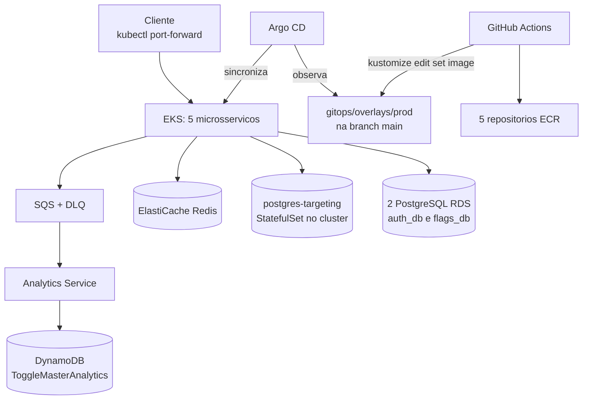
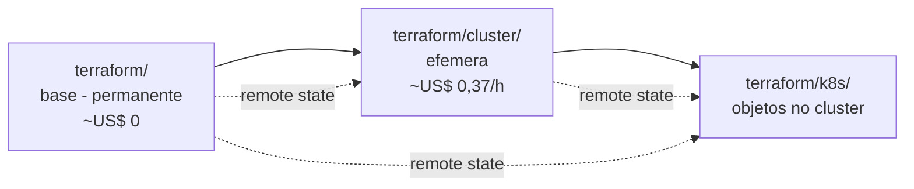
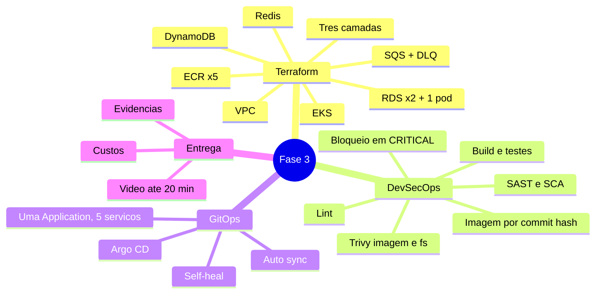

# Arquitetura da Fase 3

> **Atualizado em 2026-09-09.** A versao anterior deste arquivo veio do
> plano inicial da fase, escrito antes de o projeto existir, e descrevia
> tres coisas que nao se confirmaram: Ingress/Load Balancer, tres
> instancias RDS e o uso da `LabRole` do AWS Academy. Os tres pontos
> mudaram por decisao registrada (F-018, D-015, D-016) e o texto abaixo
> reflete o que esta de fato no codigo. O historico do Git preserva a
> versao original.

## Visao geral

Tudo e provisionado em `us-east-2`. A VPC tem duas sub-redes publicas e
duas privadas, em zonas diferentes. EKS e bancos ficam nas privadas.

Tres pontos que diferem do desenho original, e o motivo de cada um:

- **Nao ha Ingress nem Load Balancer** (F-018, D-012). O enunciado nao
  exige exposicao externa, e um ALB custaria ~US$ 16-20/mes ligado o mes
  inteiro. O acesso durante a gravacao e por `kubectl port-forward`.
- **Sao 2 RDS, nao 3** (D-015). A conta esta no plano gratuito novo da
  AWS, que **recusa** a terceira instancia com "maximum number of
  instances available with free plan accounts" (F-023). O terceiro
  banco, `targeting_db`, roda como StatefulSet dentro do EKS - mesmo
  arranjo da Fase 2, confirmado com o professor. Precisa constar no
  relatorio (O-38).
- **As roles IAM sao criadas pelo Terraform** (D-016, R-05). O projeto
  usa conta pessoal, nao AWS Academy, entao nao existe `LabRole` e nao
  ha a restricao que impediria criar IAM por codigo.

## Como as tres camadas do Terraform se encaixam

Estados separados no mesmo bucket S3. O `destroy` da camada do meio para
o custo sem levar junto os repositorios ECR e as imagens ja publicadas
(D-017).

## Mapa mental

## Seguranca

- Nenhuma credencial e versionada; somente arquivos `.example`.
- O CI autentica na AWS por **OIDC** (S-01): nao ha `AWS_ACCESS_KEY_ID`
  nem `AWS_SECRET_ACCESS_KEY` guardados no GitHub.
- Os pods acessam SQS e DynamoDB por **IRSA** (S-06): credencial
  temporaria, nada a vazar de dentro do cluster.
- Estado do Terraform em S3 com criptografia, versionamento e bloqueio
  de acesso publico.
- RDS e Redis nao sao publicos; liberam pelo security group do cluster.
- Imagens ECR sao escaneadas no push e marcadas com o hash do commit.
- Os pipelines **falham** em vulnerabilidade CRITICAL e o job de imagem
  nem chega a rodar (O-16). Excecoes, quando nao ha correcao publicada,
  ficam nominais e justificadas em `.trivyignore`.
