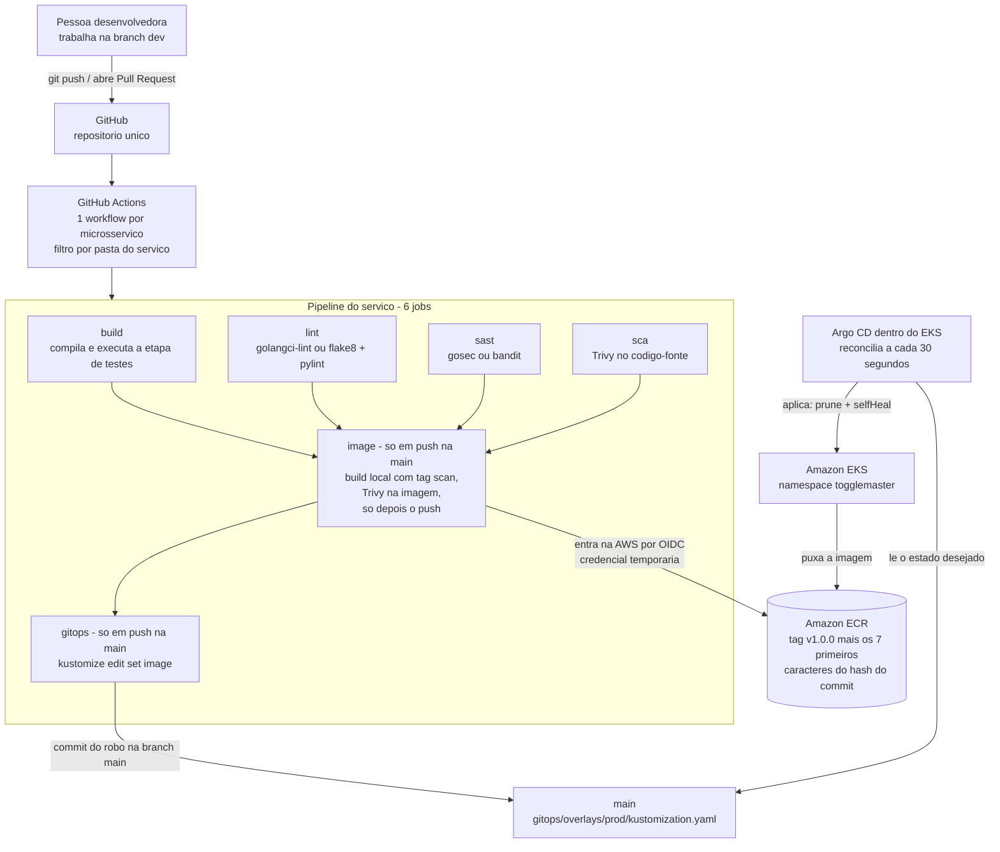
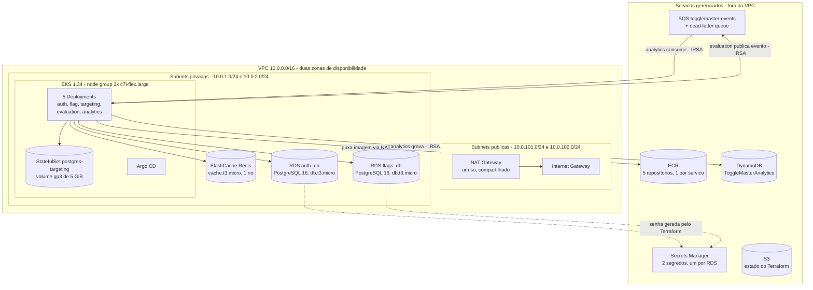
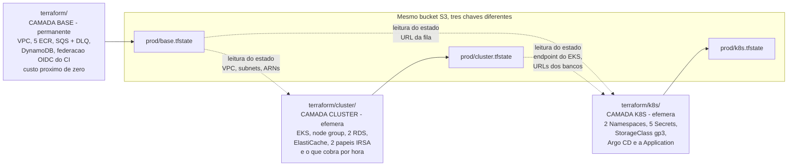

# Arquitetura

Este documento é o desenho detalhado do ToggleMaster na Fase 3. O [README](../README.md) dá a visão geral e o caminho para reproduzir o ambiente; aqui entramos no detalhe de cada peça e, principalmente, **no motivo de cada escolha** — inclusive das que contrariam o caminho mais óbvio.

A regra que orienta o projeto inteiro é curta: **se não está no código, não existe.** Nenhum recurso é criado por clique no console, nenhum deploy sai da máquina de alguém.

---

## Índice

- [Visão geral em um parágrafo](#visão-geral-em-um-parágrafo)
- [1. O fluxo completo: do commit ao pod](#1-o-fluxo-completo-do-commit-ao-pod)
- [2. A infraestrutura na AWS](#2-a-infraestrutura-na-aws)
- [3. As três camadas do Terraform](#3-as-três-camadas-do-terraform)
- [4. Os cinco microsserviços](#4-os-cinco-microsserviços)
- [5. Decisões de arquitetura](#5-decisões-de-arquitetura)
- [6. Segurança, do CI ao pod](#6-segurança-do-ci-ao-pod)
- [7. O que ficou deliberadamente de fora](#7-o-que-ficou-deliberadamente-de-fora)
- [8. Limites conhecidos deste desenho](#8-limites-conhecidos-deste-desenho)

---

## Visão geral em um parágrafo

O ToggleMaster é uma plataforma de *feature flags*: cinco microsserviços que permitem ligar e desligar funcionalidades de um aplicativo em tempo real, sem novo deploy. A aplicação veio pronta da fase anterior e **não teve uma linha de lógica alterada**. O que a Fase 3 constrói é tudo que está em volta dela: a infraestrutura escrita em Terraform, a esteira de build com barreiras de segurança, o registro de imagens e a entrega contínua por GitOps. O produto desta fase não é o aplicativo — é a esteira.

Tudo vive na região `us-east-2` (Ohio), em uma conta AWS pessoal (não é conta de laboratório acadêmico), e toda a identidade de acesso — tanto do CI quanto dos pods — é criada pelo próprio Terraform.

---

## 1. O fluxo completo: do commit ao pod

Uma mudança de código atravessa sete estágios até virar um pod rodando. Nenhum deles é manual.



### O que acontece em cada estágio

**1. O commit.** O trabalho humano parte sempre da branch `dev`. Cada microsserviço tem um workflow chamador próprio, e cada um só desperta quando muda alguma coisa que lhe diz respeito: a pasta do serviço, o próprio arquivo do workflow ou o workflow reutilizável da linguagem. Mexer no `auth-service` não gasta cinco execuções de CI.

**2. Os quatro portões em paralelo.** `build`, `lint`, `sast` e `sca` rodam ao mesmo tempo, tanto em *pull request* quanto em push. Os dois serviços em Go usam `golangci-lint` e `gosec`; os três em Python usam `flake8` mais `pylint` e `bandit`. A análise de dependências é feita pelo Trivy sobre o código-fonte.

**3. A barreira.** Este é o coração do requisito de DevSecOps, e ele **não é um script** — é uma declaração de dependência entre jobs. O job que constrói a imagem declara `needs: [build, lint, sast, sca]`. Se qualquer um dos quatro falhar, o job da imagem **nunca é agendado**: ele aparece como *skipped* no painel do GitHub, e a imagem vulnerável não chega a existir. Não há como um pipeline "passar com aviso".

Vale dizer com todas as letras onde essa parte do fluxo acontece: os jobs `image` e `gitops` são condicionados a **push na branch `main`**. Em `dev` e em *pull request* rodam apenas os quatro portões — nenhuma imagem é publicada e nenhuma tag é alterada antes do merge.

**4. O escaneamento antes do push.** Dentro do job da imagem a ordem importa: a imagem é construída localmente com a tag `:scan`, o Trivy a examina, e **só então** o runner faz login no ECR e envia. Uma imagem reprovada nunca toca o registro. São **duas varreduras do Trivy por pipeline de serviço** — uma sobre o código-fonte, no job `sca`, e uma sobre a imagem, no job `image`. Como existem dois workflows reutilizáveis (um para Go, um para Python), são quatro declarações de Trivy no repositório, todas com `severity: CRITICAL` e `exit-code: 1`.

**5. A publicação.** A imagem vai para o ECR com a tag `v1.0.0-` seguida dos sete primeiros caracteres do hash do commit. A mesma imagem também recebe `latest`, mas o GitOps referencia apenas a tag do commit, que é única e rastreável até a linha de código que a gerou.

**6. O commit do robô.** O último job instala o binário autônomo do `kustomize` e roda `kustomize edit set image` dentro de `gitops/overlays/prod`, alterando **um único campo**: a tag daquele serviço. O commit vai direto para a `main` com a mensagem `chore(gitops): <serviço> para <tag> [skip ci]`.

Como os cinco pipelines podem terminar juntos e todos escrevem no mesmo arquivo, esse passo é um laço de até cinco tentativas que, a cada volta, busca o estado atual do remoto, **descarta o trabalho local** (`git fetch` seguido de `git reset --hard`) e reaplica apenas a própria linha. Sem merge, não há conflito possível — a operação é idempotente por construção.

**7. A reconciliação.** O Argo CD observa `gitops/overlays/prod` na branch `main` e aplica a diferença no cluster. A política de sincronização é automática, com `prune` (o que sai do Git sai do cluster) e `selfHeal` (alteração feita à mão no cluster é desfeita). Em caso de falha, tenta de novo até cinco vezes, com espera dobrando a cada tentativa, de 5 segundos até o teto de 3 minutos.

> **Por que a branch `main` anda sozinha.** O commit do passo 6 é feito pelo robô do CI direto na `main`, porque é de lá que o Argo CD lê o estado desejado. Fazer o robô abrir um Pull Request para si mesmo colocaria uma fila de aprovação humana no meio do caminho crítico do GitOps — exatamente o gargalo que a fase existe para eliminar.

### Os outros workflows

A pasta `.github/workflows/` tem nove arquivos: os cinco chamadores (um por microsserviço), os dois reutilizáveis descritos acima e mais dois que valem menção porque não fazem parte do caminho da imagem:

- **Terraform Check** roda `terraform fmt -recursive -check` e `terraform validate` nas três camadas, com filtro de caminho em `terraform/`. É a rede de segurança contra código de infraestrutura mal formatado ou inválido chegar na `main`.
- **Compose Integration** sobe os cinco serviços em Docker Compose e roda um teste de ponta a ponta. Dispara em **todo pull request** e em push na `main`. Ele é um workflow independente: **não** é um dos quatro portões do job da imagem, e sua falha não impede a publicação de uma imagem. O que ele cobre está descrito na [seção 8](#8-limites-conhecidos-deste-desenho).

---

## 2. A infraestrutura na AWS



### O que está onde, e por quê

| Camada de rede | O que mora ali | Racional |
|---|---|---|
| Subnets **públicas** (2, uma por zona) | Apenas o NAT Gateway e o Internet Gateway | Nenhuma carga de trabalho tem endereço público. A subnet pública existe para dar saída à internet, não entrada |
| Subnets **privadas** (2, uma por zona) | Nós do EKS, os 2 RDS, o ElastiCache | Sem rota de entrada vinda da internet. A saída (baixar imagem do ECR, falar com a API do SQS) passa pelo NAT |

Detalhes que valem registro:

- **NAT único, não um por zona.** Um NAT por zona é o padrão de produção e elimina um ponto único de falha. Na estimativa oficial do projeto, o item de VPC — um NAT Gateway, um IPv4 público e 1 GB processado — sai por US$ 36,54 por mês; um segundo praticamente dobraria essa linha. Num projeto de estudo com orçamento fechado, o ponto único de falha é aceitável e a despesa recorrente não é.
- **O endpoint do Kubernetes é público e privado ao mesmo tempo.** Público porque o `kubectl` da máquina de quem trabalha precisa alcançar a API sem VPN; privado porque os nós conversam com o plano de controle por dentro da VPC.
- **Os bancos não são acessíveis de fora.** A regra de entrada do security group dos RDS libera a porta 5432 **exclusivamente** para o security group do cluster — não para um bloco de IPs, não para a VPC inteira. Nenhum dos dois tem endereço público.
- **A fila tem dead-letter queue.** Mensagem que falha cinco vezes sai da fila principal e vai para a DLQ, onde fica 14 dias. Sem isso, uma mensagem defeituosa circularia para sempre, ocupando o consumidor.
- **A tabela DynamoDB é sob demanda**, com `event_id` como chave de partição e criptografia em repouso ligada. Não há capacidade provisionada para dimensionar nem para pagar ociosa.

---

## 3. As três camadas do Terraform

Esta é a decisão estrutural mais importante do projeto, e a que mais economiza dinheiro.



### Como as camadas se leem

Elas **não** compartilham estado: cada uma tem a sua própria chave no bucket. O que uma precisa da outra vem por `terraform_remote_state`, um mecanismo de **somente leitura** — a camada de baixo publica valores em `output`, a de cima lê. Nenhuma escreve no estado da outra.

Na prática:

- A camada **cluster** lê da base: identificador da VPC, listas de subnets privadas e públicas, ARN da fila SQS e ARN da tabela DynamoDB. Os dois últimos são usados para montar as políticas de permissão dos pods com o ARN exato do recurso, sem curinga.
- A camada **k8s** lê das duas: da base, a URL da fila, que vai para o ConfigMap; do cluster, o endereço e o certificado da API do Kubernetes (usados para autenticar o provider), os endpoints dos bancos e as URLs de conexão completas.

O efeito colateral desejado é a **falha rápida**: se alguém tentar aplicar a camada k8s sem o cluster existir, o `terraform_remote_state` falha com "estado remoto não encontrado" antes de qualquer recurso ser tocado. É melhor do que tentar criar um Secret num cluster inexistente e descobrir dez minutos depois.

### Ordem e ritmo

| Camada | Quando sobe | Quando desce | Tempo aproximado |
|---|---|---|---|
| `terraform/` | Uma vez, no início do projeto | Nunca, dentro do prazo da entrega | poucos minutos |
| `terraform/cluster/` | No começo de cada sessão de trabalho | No fim de cada sessão | cerca de 25 minutos para subir |
| `terraform/k8s/` | Depois do cluster, em **dois comandos** | Junto com o cluster | poucos minutos |

O bloqueio de estado usa o mecanismo nativo do S3 (`use_lockfile`), e não uma tabela DynamoDB dedicada — é por isso que as três camadas declaram `required_version >= 1.11.0`. O workflow de verificação do Terraform no CI executa a versão 1.16.0.

> **Por que a camada k8s precisa de dois comandos.** O recurso que cria a *Application* do Argo CD valida o tipo dela contra o cluster ainda na fase de planejamento. Mas esse tipo — um recurso customizado — só passa a existir depois que o Argo CD é instalado, o que acontece na fase de aplicação. Num cluster novo, o comando único falha com `no matches for kind "Application"`, e declarar dependência entre recursos não resolve, porque o problema é de ordem entre *plan* e *apply*, não entre recursos. O primeiro apply é, portanto, limitado à instalação do Argo CD (com `-target`), e o segundo cria o resto. Com cluster efêmero, isso acontece **toda sessão** — não é um detalhe de primeira vez.

### Módulos

São sete módulos escritos no projeto — `ecr`, `eks`, `elasticache`, `iam-ci`, `irsa`, `messaging` e `rds` —, cada um com `main.tf`, `variables.tf` e `outputs.tf`. O único módulo de terceiros é o de VPC da comunidade: reproduzir à mão VPC, gateways, tabelas de rota e associações seria bastante código para chegar exatamente no mesmo lugar. ECR, EKS, RDS, ElastiCache, SQS e IAM são simples o bastante para ficarem autorais, e ficaram — inclusive porque é sobre esse código que a entrega é avaliada.

A restrição do provider da AWS é `>= 5.46`, **sem teto**. Fixar `~> 6.0` criava um conflito insolúvel com a restrição interna do módulo de VPC e travava o `terraform init`. Quem garante a reprodutibilidade é o arquivo de lock, versionado no Git nas três camadas — que é o lugar certo para isso.

---

## 4. Os cinco microsserviços

A aplicação é a mesma da fase anterior, sem alteração de lógica. Duas linguagens, três padrões de persistência diferentes.

| Serviço | Linguagem | Papel | Porta | Persistência |
|---|---|---|---|---|
| **auth-service** | Go 1.25 | O porteiro: emite e valida as chaves de API que os outros serviços exigem | 8001 | **RDS PostgreSQL** — banco `auth_db` |
| **flag-service** | Python 3.12 | O painel de controle: cadastro das flags, com criação, leitura, alteração e remoção | 8002 | **RDS PostgreSQL** — banco `flags_db` |
| **targeting-service** | Python 3.12 | O selecionador: guarda as regras de quem enxerga cada flag | 8003 | **PostgreSQL dentro do cluster** — StatefulSet com volume gp3 |
| **evaluation-service** | Go 1.25 | O juiz: responde "este usuário deve ver esta flag?" com verdadeiro ou falso | 8004 | **Nenhum banco próprio.** Cache Redis com validade de 30 segundos; publica cada decisão no SQS |
| **analytics-service** | Python 3.12 | O contador: consome os eventos da fila e os grava | 8005 | **DynamoDB**, alimentado pelo **SQS** |

### Detalhes que mudam o desenho

- **O `evaluation-service` é o caminho quente.** É ele que recebe a pergunta em tempo real, e é o único que consulta o `flag-service` e o `targeting-service` por HTTP interno, guardando a resposta em cache por 30 segundos. A publicação do evento no SQS é assíncrona, feita fora do caminho da resposta: registrar a estatística nunca pode atrasar a resposta ao aplicativo.
- **Não é o único a fazer chamada interna.** O `flag-service` e o `targeting-service` também falam com o `auth-service` por HTTP, para validar a chave de API de quem os chamou. A malha é pequena e toda interna, sempre por nome de Service.
- **O `analytics-service` quase não é um serviço HTTP.** Ele expõe apenas `/health`. O trabalho real é feito por uma thread daemon que fica em laço lendo mensagens da fila e gravando na tabela. A rota de saúde existe para que o Kubernetes consiga sondá-lo.
- **A comunicação interna é por nome de Service.** Os endereços vêm de ConfigMaps: `http://auth-service:8001`, `http://flag-service:8002`, `http://targeting-service:8003`. Nada de IP fixo, nada de descoberta externa.
- **Todos os cinco têm sonda de prontidão e de vitalidade** apontando para `/health`. O banco em pod é sondado com `pg_isready`.
- **Dimensionamento automático em dois deles.** `evaluation` e `analytics` têm HorizontalPodAutoscaler de 1 a 2 réplicas, com alvo de 70% de CPU — são os dois que sofrem variação de carga. Os outros três rodam com uma réplica fixa. O addon `metrics-server` é provisionado pelo Terraform, então os HPAs têm de onde ler a métrica.
- **Os cinco contêineres rodam como usuário não-privilegiado.** Todos os Dockerfiles são multi-estágio e declaram `USER app` antes do comando de inicialização. Os serviços em Go são empacotados em `alpine:3.20`; os em Python, em `python:3.12-slim`.

Os manifestos renderizados do overlay de produção somam 23 objetos: 6 Services, 6 ConfigMaps, 5 Deployments, 2 ServiceAccounts, 2 HorizontalPodAutoscalers, 1 StatefulSet e 1 Namespace.

---

## 5. Decisões de arquitetura

### Por que três camadas de estado separado

A primeira versão do Terraform tinha um estado só, com tudo dentro. Funcionava — até a gente olhar para a conta.

O ambiente precisa ser destruído ao fim de cada sessão para não queimar o crédito disponível. Com estado único, o `destroy` levaria junto os cinco repositórios do ECR e, como eles têm exclusão forçada ligada, **as imagens já publicadas**. Na sessão seguinte, o CI teria que reconstruir e reenviar cinco imagens antes de qualquer coisa. Pior: a federação OIDC que dá acesso ao CI também morreria, e ela é justamente o que o CI usa para publicar as imagens. O ambiente ficaria preso num ciclo em que subir de novo depende de algo que foi destruído.

A divisão resolve isso separando pelo **tempo de vida**, não pelo tipo de recurso:

- O que é **permanente e praticamente gratuito** — rede, repositórios de imagem, fila, tabela, identidade do CI — fica na base e nunca é destruído.
- O que **cobra por hora** — cluster, nós, bancos gerenciados, cache — fica na camada do meio, que sobe e desce por sessão.
- O que **vive dentro do cluster** e morre com ele fica na terceira.

O efeito em dinheiro é direto. A estimativa oficial do projeto, feita na calculadora da AWS e registrada com captura de tela, aponta **US$ 281,03 por mês** com tudo ligado as 730 horas — algo perto de **US$ 0,39 por hora**. Como só a camada do meio fica de pé durante o trabalho, uma sessão de três horas custa em torno de **US$ 1,15**.

O preço a pagar é real e vale dizer: existe uma ordem obrigatória entre as camadas, e quem estiver operando precisa conhecê-la. O acoplamento por leitura de estado remoto torna isso explícito no código, mas não o elimina.

### Por que 2 instâncias RDS e um banco dentro do cluster

O enunciado pede três instâncias RDS PostgreSQL. A conta está no plano gratuito novo da AWS, e ela **recusa** a terceira com a mensagem literal:

```
maximum number of instances available with free plan accounts
```

Isso não é estouro de orçamento nem alerta de custo — é recusa da API, sem meio-termo e sem opção de aceitar pagar a mais.

A saída foi manter `auth_db` e `flags_db` no serviço gerenciado e rodar o terceiro, `targeting_db`, como StatefulSet PostgreSQL dentro do próprio cluster, com disco EBS persistente pedido por `volumeClaimTemplates` e a classe de armazenamento declarada explicitamente pelo nome. É o mesmo arranjo usado na fase anterior, e o professor confirmou que segue aceito.

A consequência honesta: esse banco não tem backup automático, não tem *failover* e some se o volume for apagado junto com o cluster. Para o `targeting_db`, cujo conteúdo é recriado pelo passo de carga inicial em cada sessão, isso é aceitável. Não seria, para o banco de autenticação.

### Por que não há Ingress nem Load Balancer

A fase anterior expunha os serviços por um Ingress com cinco rotas. Mantê-lo exigiria um balanceador de carga na AWS, entre US$ 16 e US$ 20 por mês, ligado continuamente — porque um balanceador não tem como "descer com a sessão" se a ideia é ele ser a porta de entrada.

Antes de cortar, o enunciado da fase foi lido inteiro procurando por essa exigência. Ele **não menciona** ingress, balanceador nem acesso externo em nenhuma das sete páginas. Nenhum entregável em vídeo depende de um endereço público.

Então os Services continuam todos internos ao cluster, e o acesso durante a demonstração é por `kubectl port-forward`.

Vale seguir a linha causal até o fim, porque essa decisão tem um efeito não óbvio: **sem balanceador, não há endereço público para o Argo CD receber webhook do GitHub.** Um webhook é o que faz o Argo CD reagir a um commit no instante em que ele acontece. Sem ele, sobra a varredura periódica — cujo padrão é de 3 minutos, tempo demais para caber numa demonstração gravada. Por isso o intervalo de reconciliação foi reduzido para **30 segundos** na configuração do chart. É uma compensação deliberada de uma escolha feita por custo, não um valor arbitrário.

### Por que OIDC no CI e IRSA nos pods, em vez de chaves estáticas

O enunciado lista, entre as dores a resolver, credenciais trafegando em arquivo de texto. A resposta mais rápida seria gerar um par de chaves de acesso da AWS e guardá-lo nos *secrets* do GitHub. Ela funciona, e é exatamente o que o projeto decidiu não fazer.

Uma chave estática tem três problemas que nenhuma boa intenção resolve: ela não expira sozinha, ela vale para qualquer pessoa que a obtenha, e quem a possui não precisa provar de onde está chamando.

**Do lado do CI, a substituta é o OIDC.** Em vez de guardar uma chave, o GitHub apresenta à AWS um token assinado que diz quem é e de onde veio; a AWS o troca por credenciais temporárias. A relação de confiança da função IAM exige duas condições: que a audiência do token seja o serviço de tokens da AWS (`sts.amazonaws.com`), e que o assunto do token comece com o caminho deste repositório específico (`repo:<organização>/<repositório>:*`). Um fork do projeto não consegue assumir a função nem que copie o arquivo de workflow inteiro. E a permissão anexada não é `ecr:*` na conta — as ações de envio de camada e registro de manifesto são restritas aos ARNs dos cinco repositórios, que o próprio Terraform liga passando a saída do módulo de ECR como entrada do módulo de IAM.

**Do lado do cluster, a substituta é o IRSA.** Um pod que precisa falar com a AWS recebe uma identidade própria, vinculada à ServiceAccount dele, e não à identidade da máquina em que calhou de rodar. São dois papéis, ambos no namespace da aplicação:

- o do `evaluation-service` pode **enviar** mensagem na fila, e só na fila cujo ARN foi passado;
- o do `analytics-service` pode **receber e apagar** mensagem daquela fila e **gravar** na tabela cujo ARN foi passado.

Nenhum dos dois tem curinga em recurso nem em ação. Se um pod for comprometido, o atacante herda exatamente essas permissões e nada além — não o acesso da máquina, não o acesso dos outros pods.

O resultado somado é o que dá para afirmar sem ressalva: **não existe `AWS_ACCESS_KEY_ID` nem `AWS_SECRET_ACCESS_KEY` em lugar nenhum** — nem no repositório, nem nos *secrets* do GitHub, nem dentro do cluster. O custo disso foram cerca de quarenta linhas de Terraform e zero componente novo em execução.

### Por que Kustomize e não Helm para as aplicações

O enunciado aceita YAML puro ou Helm. A escolha foi Kustomize, por um motivo que só aparece quando se olha para o último passo do pipeline.

O robô do CI precisa alterar **um campo**: a tag da imagem de um serviço. Com Kustomize, isso é um comando de primeira classe, `kustomize edit set image`, que reescreve aquele campo e nada mais. O commit resultante é uma linha, legível no diff de qualquer Pull Request. Com Helm, a tag moraria num arquivo de valores, e o pipeline precisaria de um editor de YAML genérico — `sed`, `yq` — para encontrá-la e trocá-la. Ferramenta de texto editando estrutura é a origem clássica de erro silencioso em pipeline.

Há três razões menores que somam na mesma direção. Kustomize é nativo do `kubectl` e do Argo CD, então não entra nenhuma peça nova. Não existe linguagem de template entre o que está escrito e o que é aplicado, o que significa que `kubectl kustomize gitops/overlays/prod` mostra, antes de qualquer sincronização, exatamente o que vai para o cluster. E o overlay expressa bem o que de fato varia: tags de imagem, endpoints da AWS e anotações de IRSA — um punhado de campos, não uma matriz de configuração.

Vale registrar que o projeto **não é anti-Helm**: o próprio Argo CD é instalado pelo chart oficial, com versão fixada, através do provider Helm dentro do Terraform. A regra que emergiu é simples — Helm para consumir software de terceiros, que já vem empacotado assim; Kustomize para os manifestos da casa, que a gente mesmo escreve.

### Por que monorepo com pasta `gitops/`, e não um repositório separado

A literatura de GitOps costuma recomendar separar o repositório de código do repositório de manifestos. O projeto fez o contrário, conscientemente.

O argumento decisivo é de segurança, e ele fecha o ciclo com a decisão anterior. Se os manifestos vivessem em outro repositório, o pipeline precisaria de uma credencial para escrever lá — um token pessoal ou uma aplicação do GitHub, guardados nos *secrets*. Seria reintroduzir exatamente a classe de segredo estático que o projeto eliminou ao adotar OIDC, com o agravante de ser uma credencial com poder de escrita no repositório que define o estado do cluster. No monorepo, o robô usa o token efêmero que o próprio GitHub Actions concede à execução, com escopo limitado ao repositório em que está rodando.

Os outros dois motivos são de operação. Primeiro, revisão: no monorepo, um Pull Request mostra a mudança de código e a mudança de manifesto lado a lado — quem revisa vê a alteração de porta no código e no ConfigMap na mesma tela. Segundo, custo de sessão: uma pessoa que entra no projeto clona uma coisa e tem tudo, do Terraform ao workflow.

O risco clássico do monorepo é o commit de manifesto disparar o pipeline de código, que gera outro commit de manifesto, num laço infinito. Ele é evitado por **dois mecanismos diferentes, e os dois são necessários**:

- O **filtro de caminho** cobre os cinco workflows de serviço: `gitops/**` não está na lista de gatilhos de nenhum deles, então o commit do robô não os acorda.
- A marcação **`[skip ci]`** na mensagem do commit cobre o resto. O workflow de integração em Compose dispara em push na `main` **sem** filtro de caminho; é o `[skip ci]` que impede o GitHub de agendá-lo. Ele não é redundante — é o que segura esse caso.

O preço já foi dito: como o robô comita na `main`, a branch principal se move sem intervenção humana. A disciplina que compensa isso é sincronizar a branch de desenvolvimento antes de começar qualquer trabalho.

### Por que a versão do EKS escolhida

O planejamento inicial apontava a versão 1.31, simplesmente porque era o padrão do módulo. Uma consulta à API de versões do EKS antes de orçar mostrou que essa versão já havia saído do suporte padrão e migrado para o **suporte estendido** — o que leva o plano de controle de **US$ 0,10 por hora para US$ 0,60 por hora**. Seis vezes mais caro, por nada: nenhum recurso do projeto depende daquela versão. As versões 1.32 e 1.33 estavam na mesma situação.

A escolha foi a **1.34**, que a mesma consulta apontou em suporte padrão até **2026-12-01**, com margem confortável sobre o prazo da entrega. É também a mais madura entre as de suporte padrão, o que reduz o risco de incompatibilidade de addon. Esse é um dado com validade: a janela de suporte muda com o tempo, e quem retomar o projeto meses depois deve reconferir na fonte antes de aplicar.

A lição que sobra é generalizável, e é a razão de esta decisão estar registrada: **valor padrão de módulo envelhece, e no caso do EKS o preço envelhece junto com ele.** Vale conferir na fonte antes de orçar, não depois de receber a fatura.

---

## 6. Segurança, do CI ao pod

O modelo se sustenta em quatro perguntas, respondidas em ordem: quem entra na AWS, o que impede código ruim de virar imagem, onde ficam os segredos, e o que um pod consegue alcançar.

### Identidade: ninguém guarda chave

| Quem precisa de acesso | Como obtém | O que pode fazer |
|---|---|---|
| GitHub Actions | Federação **OIDC** com uma função IAM que só aceita ser assumida por este repositório | Enviar imagem para os cinco repositórios ECR nomeados pelo ARN. Nada mais |
| `evaluation-service` | **IRSA**, papel amarrado à ServiceAccount | Enviar mensagem na fila cujo ARN foi passado |
| `analytics-service` | **IRSA**, papel amarrado à ServiceAccount | Receber e apagar mensagem naquela fila; gravar na tabela cujo ARN foi passado |
| Os outros três serviços | Nenhuma identidade na AWS | Falam só com bancos e entre si, dentro da VPC |

As políticas de IRSA não têm curinga nem em recurso nem em ação. A política do CI tem **uma única exceção**, e ela é imposta pela AWS: a ação `ecr:GetAuthorizationToken`, que obtém o token de login no registro, não aceita permissão por recurso e precisa ser declarada com `*`. Ela apenas devolve um token de autenticação; tudo que de fato escreve no registro está restrito aos ARNs dos cinco repositórios. Nenhuma chave estática existe no projeto.

### Portões da esteira

O pipeline de cada serviço tem quatro portões antes da imagem existir: compilação e etapa de testes, linter, análise estática de segurança do código e análise das dependências. Falhou um, o job da imagem não é agendado.

As varreduras do Trivy são configuradas com o rigor literal: severidade `CRITICAL`, código de saída 1, e **sem** a opção que ignora vulnerabilidades ainda não corrigidas.

Essa última escolha merece explicação, porque a alternativa era tentadora. Quando o rigor literal foi ligado, o scan passou a acusar três CVEs críticos no pacote `perl-base` da imagem base dos serviços em Python. Nenhum tem versão corrigida publicada pelo Debian, e o pacote é essencial — removê-lo quebra o próprio gerenciador de pacotes e a imagem para de funcionar. Ligar `ignore-unfixed` resolveria em uma linha, mas apagaria **uma classe inteira de achados, em silêncio e para sempre**, inclusive os futuros.

O caminho escolhido foi registrar os três nominalmente em um arquivo `.trivyignore`, cada um com justificativa escrita e data de revisão: os três serviços Python não executam perl em nenhum momento (o processo do contêiner é o gunicorn servindo Flask), e o terceiro CVE ainda depende de compilação em 32 bits, enquanto as imagens são de 64 bits. Qualquer crítico fora dessa lista continua derrubando o pipeline, e cada exceção nova aparece no diff de um Pull Request.

Antes de mudar a regra, o efeito foi medido nas imagens reais publicadas no registro: a base `alpine:3.20` dos serviços em Go traz **zero** vulnerabilidades críticas, e por isso eles não têm exceção nenhuma.

> **Prova de que a barreira não é decorativa.** Quando o `continue-on-error` foi removido dos passos de varredura, o Trivy acusou uma vulnerabilidade crítica real em uma biblioteca de criptografia usada pelos dois serviços em Go — que estava no projeto havia semanas, publicada e invisível, atrás de cinco pipelines verdes. O job da imagem ficou *skipped* e a biblioteca foi atualizada. Pipeline verde não prova que o código é seguro; prova que alguém configurou o pipeline para não reclamar.

### Segredos

Nenhum segredo é versionado. O `.gitignore` bloqueia arquivos de variáveis do Terraform, `.env` (exceto o modelo de exemplo), chaves, certificados e arquivos de kubeconfig.

Os segredos nascem em dois lugares, e a distinção importa:

- As **senhas dos dois RDS** são geradas pela camada cluster e gravadas no **AWS Secrets Manager**, um segredo por banco.
- A senha do banco em pod, a chave mestra e a chave de comunicação entre serviços são geradas pela **camada k8s**, que cria cinco Secrets do Kubernetes no namespace da aplicação. As URLs de conexão com os bancos gerenciados chegam ali pela leitura do estado do cluster.

O contrato de nomes e chaves entre o Terraform e os manifestos está escrito em [`gitops/SECRETS-CONTRATO.md`](../gitops/SECRETS-CONTRATO.md) — o acoplamento é real e invisível, e por isso foi documentado em vez de deixado implícito.

Um detalhe que só aparece na segunda sessão: a chave de comunicação entre serviços é criada pelo Terraform com um valor de inicialização e depois substituída pelo valor válido no passo de carga dos dados. Sem cuidado, o apply seguinte restauraria o valor antigo por cima e derrubaria a integração — sem erro visível, porque do ponto de vista do Terraform tudo estaria correto. O Secret tem, por isso, uma regra de ciclo de vida que ignora mudanças no conteúdo. A regra geral vale anotar: quando duas ferramentas escrevem no mesmo campo, uma precisa desistir de forma explícita e documentada.

### Criptografia e isolamento

| Onde | O que está ligado |
|---|---|
| Estado do Terraform (S3) | Criptografia em repouso, versionamento e bloqueio de acesso público |
| ECR | Criptografia AES256 e varredura automática no push |
| SQS e a DLQ | Criptografia gerenciada pelo próprio serviço |
| DynamoDB | Criptografia no servidor |
| RDS | Armazenamento criptografado, sem acesso público, porta liberada só para o security group do cluster |
| ElastiCache | Criptografia em repouso |
| Volumes do cluster | StorageClass `gp3` com `encrypted = true` |

**A exceção honesta:** a criptografia **em trânsito** do Redis vem desligada por padrão. Ligá-la sem trocar o esquema da URL de conexão de `redis://` para `rediss://` derruba o `evaluation-service` na inicialização, porque ele encerra o processo se não conseguir conectar. É uma mudança de duas pontas que não foi ensaiada e, por isso, não foi ligada às cegas.

### Contêiner

As cinco imagens são multi-estágio e rodam como usuário não-privilegiado, definido no próprio Dockerfile. Os limites de CPU e memória estão declarados em todos os Deployments — sem eles, um pod com vazamento pode derrubar o nó inteiro e levar junto os outros quatro serviços.

---

## 7. O que ficou deliberadamente de fora

Cada linha aqui é uma decisão, não um esquecimento. O critério foi um só: **o enunciado é o alvo; enfeite não vale nota e custa dinheiro.**

| Deixado de fora | Por quê |
|---|---|
| **Ingress e Load Balancer** | O enunciado não menciona exposição externa em nenhuma das sete páginas. Economiza de US$ 16 a US$ 20 por mês. A demonstração usa encaminhamento de porta |
| **Múltiplos ambientes** | Um só, chamado `prod`. Cada ambiente extra multiplicaria o custo de cluster, bancos e cache pelo número de ambientes |
| **External Secrets Operator** | Estava no plano inicial e foi cortado. Ele sincronizaria segredos do Secrets Manager para dentro do cluster — mas exigiria um operador a mais em execução, com o seu próprio papel IAM, para resolver um problema que cinco recursos do Terraform resolvem sem peça nova |
| **Charts Helm próprios** | Ver a decisão sobre Kustomize. Helm entra apenas para instalar software de terceiros |
| **Tabela DynamoDB para bloqueio de estado** | O S3 passou a oferecer bloqueio nativo. Uma tabela a menos para criar, pagar e explicar |
| **Multi-AZ, réplicas de leitura, WAF, CloudFront** | São recursos de disponibilidade e proteção de produção real. Nada disso é exigido, e todos custam continuamente |
| **KEDA, DAST, Prowler, CloudTrail** | Aparecem nas aulas como evolução natural, mas estão fora do enunciado. Cada um seria uma peça nova em execução |
| **Malha de serviço e pilha de observabilidade** | Mesmo raciocínio, com custo maior. Para cinco serviços com uma réplica cada, seria mais infraestrutura de apoio do que aplicação |
| **Um NAT Gateway por zona** | Elimina um ponto único de falha, mas praticamente dobraria o item de VPC da estimativa (US$ 36,54 por mês). O ponto único é aceitável aqui; a despesa recorrente não |

---

## 8. Limites conhecidos deste desenho

Esta seção existe para que ninguém precise descobrir sozinho. São limitações reais do que está entregue, não planos.

- **Não há testes unitários — há teste de integração.** Não existe um único arquivo de teste unitário no repositório. Os pipelines de serviço têm o passo de testes e ele executa (nos serviços em Go, roda a ferramenta de teste da linguagem; nos de Python, procura arquivos de teste e informa quando não encontra nenhum), mas hoje ele não encontra nada para rodar. O que existe, e cobre bem mais do que compilação, é um **workflow separado de integração**: ele sobe os cinco serviços em Docker Compose a cada pull request e a cada push na `main` e executa um roteiro ponta a ponta — saúde dos cinco serviços, rejeição de chave de API inválida e aceitação da chave gerada, persistência, flag ligada e desligada, segmentação em 0% e em 100%, flag inexistente, uso do cache Redis, visibilidade de uma alteração após a expiração do cache e gravação dos eventos pelo consumidor da fila. A ressalva importante: esse workflow **não** é um dos quatro portões do job da imagem; ele roda em paralelo e a sua falha não impede a publicação de uma imagem.
- **Os manifestos não declaram `securityContext`.** O usuário não-privilegiado vem do `USER` no Dockerfile, o que já impede o processo de rodar como root. Mas o cluster não está exigindo isso por política, nem impedindo escalonamento de privilégio ou tornando o sistema de arquivos somente leitura.
- **Uma réplica por serviço.** Os dois com dimensionamento automático chegam a duas sob carga. Isso significa que a atualização de um Deployment tem uma janela curta de indisponibilidade, e que a perda de um nó derruba os pods que estavam nele até serem reagendados.
- **O banco em pod não tem backup.** Está dito na decisão correspondente e vale repetir aqui.
- **Dois valores do overlay precisam ser reescritos a cada sessão.** O endereço do Redis está fixo no arquivo de patches do overlay, e o ElastiCache ganha um endereço novo toda vez que a camada do cluster é recriada — o valor versionado fica obsoleto assim que o ambiente anterior é destruído. Da mesma forma, a chave de comunicação entre serviços nasce provisória e recebe o valor válido no passo de carga dos dados. O runbook da sessão traz o comando pronto para os dois casos. É o ponto em que um cluster efêmero encosta num arquivo versionado, e é o mais fácil de esquecer.
- **O identificador da conta AWS aparece no repositório** — no nome do bucket de estado, nas URLs do ECR dentro do overlay, na URL da fila SQS e nos workflows. Não é credencial e não concede acesso a nada por si só, mas é um dado da conta visível publicamente, e a decisão de deixá-lo ali foi consciente.
- **Os cinco serviços não estão necessariamente na mesma versão.** Cada pipeline atualiza a própria tag quando roda, e um serviço que não mudou não gera imagem nova. O overlay reflete isso: hoje há três commits diferentes entre as cinco tags.

---

## Para ir mais fundo

| Assunto | Onde |
|---|---|
| Visão geral, como reproduzir e time | [`README.md`](../README.md) |
| As três camadas, comandos e custo por hora | [`terraform/README.md`](../terraform/README.md) |
| Manifestos, overlay e o que cada patch faz | [`gitops/README.md`](../gitops/README.md) |
| Contrato de nomes e chaves dos Secrets | [`gitops/SECRETS-CONTRATO.md`](../gitops/SECRETS-CONTRATO.md) |
| Exceções de segurança, com justificativa e data de revisão | [`.trivyignore`](../.trivyignore) |
| Relatório de entrega, desafios e estimativa de custos | [`docs/RELATORIO_DE_ENTREGA.md`](./RELATORIO_DE_ENTREGA.md) |
| Estimativa de custos detalhada, com a captura oficial | [`docs/RELATORIO_DE_ENTREGA.md`](./RELATORIO_DE_ENTREGA.md) |
| Rodar os cinco serviços sem AWS | [`docs/OPERACAO.md`](./OPERACAO.md) |
