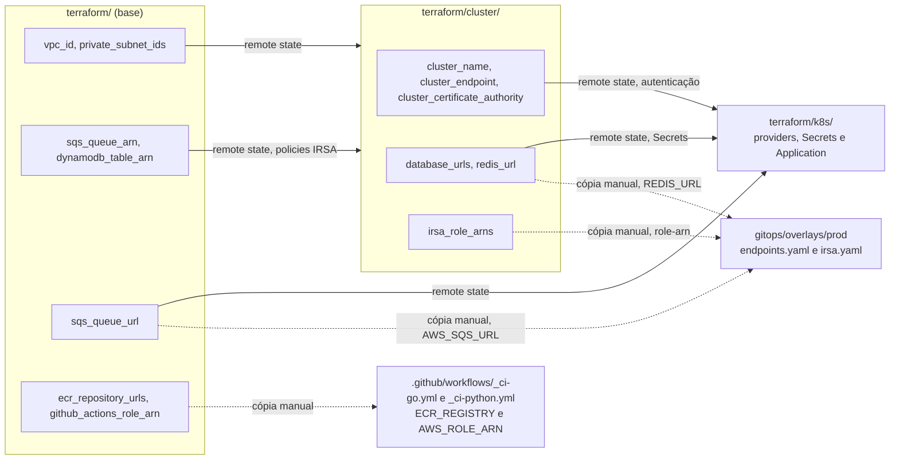

# Arquitetura do ToggleMaster

Este documento é a referência técnica da Fase 3 e complementa o [README](../README.md). Aqui ficam as tabelas: portas, recursos, versões, probes, permissões, Secrets e criptografia.

O porquê das escolhas e as dificuldades estão no README, em [Decisões e o porquê](../README.md#5-decisões-e-o-porquê). Os comandos para subir, verificar e destruir o ambiente estão no [Guia de reprodução](GUIA_DE_REPRODUCAO.md). Cada pasta tem o próprio resumo em [`terraform/README.md`](../terraform/README.md) e [`gitops/README.md`](../gitops/README.md); o relatório está em [`RELATORIO_DE_ENTREGA.md`](RELATORIO_DE_ENTREGA.md).

Seções: [1. Serviços](#1-serviços) · [2. Terraform](#2-recursos-por-camada-do-terraform) · [3. Kubernetes e GitOps](#3-kubernetes-e-gitops) · [4. ArgoCD](#4-argocd) · [5. Pipeline](#5-pipeline-em-detalhe) · [6. Identidade e segredos](#6-identidade-segredos-e-criptografia) · [7. Limitações](#7-limitações-conhecidas-do-código)

## 1. Serviços

São cinco microsserviços herdados da Fase 2, sem mudança de lógica. Dois são escritos em Go e três em Python. Eles conversam entre si pelo nome do Service do Kubernetes, por exemplo `http://auth-service:8001`.

| Serviço | Linguagem | Porta | O que faz | Depende de | Rotas |
|---|---|---|---|---|---|
| `auth-service` | Go 1.25 | 8001 | Cria e valida chaves de API | RDS `auth_db` | `/health`, `/validate`, `/admin/keys` (protegida pela `MASTER_KEY`) |
| `flag-service` | Python 3.12 | 8002 | Cadastro das flags | RDS `flags_db` e `auth-service` | `/health`, `POST/GET /flags`, `GET/PUT/DELETE /flags/<nome>` (todas, menos `/health`, exigem chave) |
| `targeting-service` | Python 3.12 | 8003 | Regras de segmentação por flag | PostgreSQL em pod e `auth-service` | `/health`, `POST /rules`, `GET/PUT/DELETE /rules/<flag_name>` (exigem chave) |
| `evaluation-service` | Go 1.25 | 8004 | Decide se um usuário vê a flag | Redis, `flag-service`, `targeting-service` e SQS | `/health`, `GET /evaluate?user_id=&flag_name=` (sem chave) |
| `analytics-service` | Python 3.12 | 8005 | Consome eventos da fila e grava na tabela | SQS e DynamoDB | só `/health` |

Imagens e dependências principais:

| Serviço | Imagem de build → execução | Dependências fixadas |
|---|---|---|
| `auth-service` | `golang:1.25-alpine` → `alpine:3.20` | pgx/v4 v4.18.3; x/crypto v0.55.0 |
| `evaluation-service` | `golang:1.25-alpine` → `alpine:3.20` | aws-sdk-go v1.51.10; go-redis/v8 v8.11.5 |
| `flag-service` | `python:3.12-slim` | Flask 2.2.2, psycopg2-binary 2.9.5, gunicorn 20.1.0, python-dotenv 0.21.0, requests 2.28.1, `setuptools<81`, `Werkzeug<3`, PyYAML 6.0.1 |
| `targeting-service` | `python:3.12-slim` | as mesmas do flag-service, sem PyYAML |
| `analytics-service` | `python:3.12-slim` | boto3 1.26.50 e python-dotenv 0.21.0; Flask, gunicorn e setuptools **sem versão** |

Os cinco Dockerfiles são multi-estágio e declaram `USER app`.

Comportamentos que moldam o desenho:

- **Cache de 30 segundos.** O `evaluation-service` guarda no Redis a flag e a regra combinadas por 30 s. Ele chama o flag e o targeting com `Authorization: Bearer <SERVICE_API_KEY>`. O envio do evento para a SQS roda numa goroutine e não atrasa a resposta.
- **Fila.** O worker do analytics faz long polling de 20 s, lê até 10 mensagens, grava no DynamoDB e só então apaga a mensagem. Depois de 5 recebimentos sem sucesso, a mensagem vai para `togglemaster-events-dlq` (retenção de 14 dias; a fila principal retém 4 dias).
- **Worker desligável.** Com `AWS_SQS_URL` vazia, o evaluation só registra um aviso e o worker do analytics não sobe. É assim no Compose local ([guia, Apêndice A](GUIA_DE_REPRODUCAO.md#apêndice-a-execução-local-com-docker-compose)).

```mermaid
sequenceDiagram
    participant C as Cliente
    participant E as evaluation-service
    participant R as Redis
    participant F as flag-service
    participant T as targeting-service
    participant A as auth-service
    participant Q as SQS
    participant N as analytics-service
    participant D as DynamoDB

    C->>E: GET /evaluate com user_id e flag_name
    E->>R: busca flag e regra no cache
    alt cache vazio ou expirado
        par em paralelo
            E->>F: GET /flags/nome com Bearer
            F->>A: GET /validate
        and
            E->>T: GET /rules/nome com Bearer
            T->>A: GET /validate
        end
        E->>R: grava por 30 s
    end
    E-->>C: true ou false
    E-)Q: evento da avaliação em goroutine
    N->>Q: receive com espera de até 20 s
    N->>D: PutItem
    N->>Q: DeleteMessage
```

## 2. Recursos por camada do Terraform

O Terraform está dividido em três pastas, cada uma com o próprio estado no mesmo bucket S3. A camada de cima só **lê** as saídas da de baixo, por `terraform_remote_state`. O bucket de estado é criado à mão, uma vez por conta ([guia, seção 3](GUIA_DE_REPRODUCAO.md#3-bucket-de-estado-do-terraform)).

| | Base `terraform/` | Cluster `terraform/cluster/` | K8s `terraform/k8s/` |
|---|---|---|---|
| **Cria** | VPC com 2 subnets públicas e 2 privadas, Internet Gateway e 1 NAT Gateway; 5 repositórios ECR; SQS `togglemaster-events` e DLQ; DynamoDB `ToggleMasterAnalytics`; provedor OIDC do GitHub (ou só leitura dele); role e policy do CI | EKS com roles do plano de controle e dos nós; provedor OIDC do cluster; node group ON_DEMAND; role do driver EBS; 5 addons; 2 RDS PostgreSQL 16 com security group e 2 segredos no Secrets Manager; ElastiCache Redis; 2 roles IRSA | Namespaces `argocd` e `togglemaster`; ArgoCD por Helm; Application `togglemaster`; 3 senhas aleatórias; 5 Secrets; StorageClass `gp3`; Secret de credencial do repositório (só com token) |
| **Chave do estado** | `prod/base.tfstate` | `prod/cluster.tfstate` | `prod/k8s.tfstate` |
| **Lê de** | nada | base | base e cluster |
| **Providers** | aws | aws, random, tls | aws, kubernetes, helm, random |
| **Recursos** | 35 com `create_github_oidc_provider=false` (2026-09-15); 36 com `true` | 35 (2026-09-15) | 13 com token vazio (2026-09-15) |

O lock do estado usa o arquivo nativo do S3 (`use_lockfile = true`), gravado como `<chave>.tflock`. Não há tabela DynamoDB de lock. Os providers da camada k8s se autenticam no cluster com `aws eks get-token`, então a AWS CLI precisa estar no PATH.

Os addons do EKS são `vpc-cni`, `coredns`, `kube-proxy`, `aws-ebs-csi-driver` e `metrics-server`.

### Como os valores fluem entre camadas

Parte das saídas é lida pelo próprio Terraform. Outra parte é copiada por uma pessoa para os workflows e para o overlay, porque esses arquivos não leem estado.



As linhas tracejadas são o ponto em que uma conta nova exige edição de arquivo. A tabela completa está no [guia, seção 2](GUIA_DE_REPRODUCAO.md#2-valores-fixos-a-trocar-em-outra-conta), e a troca do `REDIS_URL` no [guia, seção 6](GUIA_DE_REPRODUCAO.md#6-camada-cluster-e-endpoints-do-overlay).

### Variáveis importantes

| Variável | Camada | Padrão | Observação |
|---|---|---|---|
| `aws_region` | as três | `us-east-2` | AZs `us-east-2a` e `us-east-2b` |
| `vpc_cidr` | base | `10.0.0.0/16` | privadas `10.0.1.0/24` e `10.0.2.0/24`; públicas `10.0.101.0/24` e `10.0.102.0/24` |
| `enable_nat_gateway` | base | `true` | o `terraform.tfvars.example` usa `false`; sem NAT os nós não baixam imagens |
| `create_github_oidc_provider` | base | `true` | `false` quando a conta já tem o provedor; aí um data source só o lê e o destroy não o apaga |
| `github_repository` | base | `fiap-devops-arqcloud-2026/tech-challenge-03` | entra na condição `sub` da role do CI |
| `ecr_image_tag_mutability` | base | `MUTABLE` | lifecycle mantém 10 imagens por repositório |
| `kubernetes_version` | cluster | `1.34` | suporte padrão até 2026-12-01, conforme a API de versões do EKS |
| `node_instance_type` | cluster | `c7i-flex.large` | node group com mínimo 1, desejado 2, máximo 4 |
| `rds_instance_class` | cluster | `db.t3.micro` | 20 GB gp3 (teto 40), backup de 1 dia, sem Multi-AZ |
| `elasticache_node_type` | cluster | `cache.t3.micro` | 1 nó, `default.redis7` |
| `redis_transit_encryption` | cluster | `false` | ver [seção 6](#6-identidade-segredos-e-criptografia) |
| `argocd_chart_version` | k8s | `7.7.11` | chart `argo-cd` |
| `gitops_repo_url`, `gitops_repo_path`, `gitops_repo_branch` | k8s | este repositório, `gitops/overlays/prod`, `main` | alvo da Application |
| `github_token` | k8s | `""` | só para cópia privada |
| `storage_class_name` | k8s | `gp3` | casa com o StatefulSet do targeting |

### Módulos e versões

- **Módulos.** Só a VPC vem da comunidade: `terraform-aws-modules/vpc/aws ~> 5.0`, resolvido para 5.21.0. Os módulos `ecr`, `messaging`, `iam-ci`, `eks`, `rds`, `elasticache` e `irsa`, em `terraform/modules/`, são do próprio projeto.
- **Terraform.** `required_version >= 1.11.0` nas três camadas. O CI usa 1.16.0.
- **Providers declarados e travados pelo `.terraform.lock.hcl` versionado:**

| Provider | Restrição | Base | Cluster | K8s |
|---|---|---|---|---|
| aws | `>= 5.46` | 6.62.0 | 6.63.0 | 6.63.0 |
| random | `>= 3.5` | — | 3.9.0 | 3.9.0 |
| tls | `>= 4.0` | — | 4.4.0 | — |
| kubernetes | `~> 3.0` | — | — | 3.2.1 |
| helm | `~> 3.0` | — | — | 3.3.0 |

### Acesso ao cluster

O EKS usa `authentication_mode = "API_AND_CONFIG_MAP"` e `bootstrap_cluster_creator_admin_permissions = true`. Na prática, só o principal IAM que executou o apply do cluster administra o Kubernetes. Por isso a mesma identidade deve rodar as três camadas e o `kubectl`. O endpoint da API é público e privado ao mesmo tempo.

## 3. Kubernetes e GitOps

Os manifestos ficam em `gitops/`, organizados com Kustomize. A base descreve os serviços de forma neutra. O overlay `prod` acrescenta o que depende da conta e da versão publicada.

- **Base (`gitops/base/`).** Namespace `togglemaster`, rótulos comuns e imagens com nome lógico, sem registro e sem tag. Ingress e Secrets ficam de fora de propósito.
- **Overlay (`gitops/overlays/prod/`).** Muda três coisas:
  - bloco `images`: registro ECR da conta e tag `v1.0.0-<sha7>`, reescrita pelo CI;
  - `patches/endpoints.yaml`: `REDIS_URL` no ConfigMap do evaluation e `AWS_SQS_URL` nos do evaluation e do analytics;
  - `patches/irsa.yaml`: anotação `eks.amazonaws.com/role-arn` nas ServiceAccounts `evaluation-service` e `analytics-service`.

`kubectl kustomize gitops/overlays/prod` renderiza 23 objetos:

| Tipo | Quantidade | Detalhe |
|---|---|---|
| ConfigMap | 6 | 5 serviços e `postgres-targeting-init` |
| Service | 6 | 5 ClusterIP e 1 headless (`postgres-targeting`) |
| Deployment | 5 | todos com `replicas: 1` |
| HorizontalPodAutoscaler | 2 | evaluation e analytics |
| ServiceAccount | 2 | evaluation e analytics |
| StatefulSet | 1 | `postgres-targeting` |
| Namespace | 1 | `togglemaster` |

### Probes e recursos

| Workload | requests cpu/mem | limits cpu/mem | readiness (atraso/período/falhas) | liveness |
|---|---|---|---|---|
| auth | 50m / 64Mi | 200m / 128Mi | HTTP `/health` 10s/10s/3 | 30s/30s/3 |
| flag | 100m / 128Mi | 300m / 256Mi | HTTP `/health` 15s/10s/3 | 30s/30s/3 |
| targeting | 100m / 128Mi | 300m / 256Mi | HTTP `/health` 15s/10s/3 | 30s/30s/3 |
| evaluation | 100m / 64Mi | 500m / 128Mi | HTTP `/health` 10s/10s/3 | 30s/30s/3 |
| analytics | 100m / 128Mi | 300m / 256Mi | HTTP `/health` 15s/10s/3 | 30s/30s/3 |
| postgres-targeting | 100m / 128Mi | 500m / 512Mi | exec `pg_isready` 10s/10s/6 | 30s/20s/3 |

O `/health` dos serviços não consulta o banco. Pod pronto não prova que as tabelas existem.

**HPAs.** `evaluation-service-hpa` e `analytics-service-hpa` usam `autoscaling/v2`, de 1 a 2 réplicas com alvo de 70% de CPU. A métrica vem do addon `metrics-server`, instalado pela camada cluster.

### StatefulSet `postgres-targeting` e armazenamento

- Imagem `postgres:16-alpine`, fora do pipeline; 1 réplica; `serviceName: postgres-targeting`.
- `PGDATA` num subdiretório, para não conflitar com o `lost+found` do disco EBS.
- `init.sql` montado a partir de ConfigMap em `/docker-entrypoint-initdb.d`. É por isso que o schema do targeting já nasce pronto.
- PVC `data`: `ReadWriteOnce`, `storageClassName: gp3`, 5Gi.
- StorageClass `gp3` (camada k8s): padrão do cluster, provisioner `ebs.csi.aws.com`, `WaitForFirstConsumer`, `reclaim_policy = Delete`, expansão permitida, `encrypted = "true"`. Com `Delete`, destruir a camada k8s apaga o disco junto com o PVC.

**Exposição.** Todos os Services são ClusterIP. Não há Ingress nem Load Balancer; o acesso é por `kubectl port-forward`.

**Fora do overlay.** A camada `terraform/k8s` cria no cluster 13 recursos com o token vazio: 2 namespaces, 1 `helm_release`, 1 Application, 3 `random_password`, 5 Secrets e 1 StorageClass. Com token, entra também o Secret de credencial do repositório.

## 4. ArgoCD

O ArgoCD lê o overlay na branch `main` e aplica no cluster o que mudou. O CI nunca executa `kubectl apply`.

**Instalação** (`terraform/k8s/argocd.tf`). Chart `argo-cd` 7.7.11 de `https://argoproj.github.io/argo-helm`, no namespace `argocd`, com `wait = true` e `timeout = 600`. Os values desligam `dex`, `applicationSet` e `notifications`, ligam `server.insecure = true` (acesso por port-forward, sem TLS de borda), baixam `timeout.reconciliation` para 30s (o padrão é 180 s) e usam 1 réplica de controller, server e repoServer.

**Application `togglemaster`:**

| Campo | Valor |
|---|---|
| Origem | este repositório, `gitops/overlays/prod`, `targetRevision: main` |
| Destino | `https://kubernetes.default.svc`, namespace `togglemaster` |
| Sincronização | `automated` com `prune = true` e `selfHeal = true` |
| Opções | `CreateNamespace=true` |
| Nova tentativa | até 5, espera de 5 s com fator 2, teto de 3 min |

**Credencial do repositório.** O Secret do tipo `repository` tem `count = var.github_token != "" ? 1 : 0`. Com o repositório público, o token fica vazio e o Secret não existe.

**Primeiro apply em duas etapas.** A Application é um `kubernetes_manifest`, que valida o tipo contra o cluster já no `plan`. O CRD `Application` só existe depois que o chart é instalado. Por isso, primeiro se aplica só `helm_release.argocd` e depois o restante ([guia, seção 7](GUIA_DE_REPRODUCAO.md#7-camada-k8s-e-argocd)).

**Sem webhook.** Um webhook do GitHub exigiria endereço público para o `argocd-server`. Sem Ingress nem Load Balancer, a detecção é por consulta periódica, e os 30 s de reconciliação compensam isso.

## 5. Pipeline em detalhe

A esteira está em `.github/workflows/`: 5 chamadores (um por serviço), 2 reutilizáveis (Go e Python), o Terraform Check e o Compose Integration.

### Workflows e gatilhos

| Workflow | push | pull_request (destino) | Filtros de caminho | Manual |
|---|---|---|---|---|
| `auth-service.yml`, `evaluation-service.yml` | `main`, `dev` | `main`, `dev` | `services/<svc>/**`, o próprio arquivo e `_ci-go.yml` | sim |
| `flag-service.yml`, `targeting-service.yml`, `analytics-service.yml` | `main`, `dev` | `main`, `dev` | `services/<svc>/**`, o próprio arquivo e `_ci-python.yml` | sim |
| `_ci-go.yml`, `_ci-python.yml` | — | — | só `workflow_call` | não |
| `terraform-check.yml` | `main` | qualquer | `terraform/**` e o próprio arquivo | sim |
| `compose-integration.yml` | `main` | qualquer | nenhum | sim |

Consequências diretas:

- `gitops/**` não está em nenhum filtro. O commit do robô não acorda os pipelines de serviço.
- Qualquer arquivo dentro de `services/<svc>/`, inclusive `README.md`, dispara o pipeline do serviço.
- `workflow_dispatch` e pull request rodam só as verificações. Imagem e GitOps exigem push na `main`.

### Jobs por linguagem

| Job | Go (`auth`, `evaluation`) | Python (`flag`, `targeting`, `analytics`) |
|---|---|---|
| `build` | `setup-go` com a versão do `go.mod`; `go build -v ./...` e `go test -count=1 -v ./...` | `setup-python` 3.12; `pip install -r requirements.txt`; `compileall -q .`; pytest só se houver testes (hoje não há, e o passo avisa) |
| `lint` | `golangci-lint-action@v9`, versão v2.13.2 | flake8 bloqueia só `E9,F63,F7,F82` (estilo com `--exit-zero`, 120 colunas); pylint com `.pylintrc` |
| `sast` | Go 1.25; gosec v2.29.0 com `-severity high -confidence medium` | `bandit -r . -ll` |
| `sca` | Trivy `scan-type: fs` | Trivy `scan-type: fs` |
| `image` | `needs: [build, lint, sast, sca]`; só push na `main` | idem |
| `gitops` | `needs: [image]`; só push na `main` | idem |

Os quatro primeiros rodam em paralelo. Se um falha, `image` fica *skipped* e `gitops` também.

### O que está fixado e o que não está

| Fixado | Não fixado |
|---|---|
| golangci-lint v2.13.2 | flake8 |
| gosec v2.29.0 | pylint |
| `aquasecurity/trivy-action` pelo SHA `ed142fd0673e97e23eac54620cfb913e5ce36c25` (v0.36.0), que instala o binário Trivy v0.70.0 | bandit |
| kustomize 5.4.3 | docker do runner |
| Terraform 1.16.0 (Terraform Check) | |
| Python 3.12; Go 1.25 no SAST | |

### Regra do Trivy

Os quatro scans (fs e imagem, em Go e Python) usam `severity: CRITICAL`, `exit-code: "1"`, `ignore-unfixed: false` e `trivyignores: .trivyignore`. HIGH e abaixo aparecem no log, mas não bloqueiam.

O [`.trivyignore`](../.trivyignore) tem três exceções nominais: `CVE-2026-13221`, `CVE-2026-8376` e `CVE-2026-42496`. As três são do `perl-base` do Debian dentro de `python:3.12-slim`, sem versão corrigida, num pacote essencial que nenhum serviço executa. A medição foi feita em 2026-09-09 e a revisão está marcada para 2026-10-15. A base `alpine:3.20` dos serviços Go foi medida com zero CRITICAL, mas o arquivo é global e vale para todos os scans.

### Job `image`, em ordem

1. Calcula a tag `v1.0.0-` mais os 7 primeiros caracteres do SHA do commit. O prefixo é fixo.
2. `docker build -t <svc>:scan .`
3. Trivy na imagem local. **O scan vem antes de qualquer login ou push.**
4. `aws-actions/configure-aws-credentials@v4` por OIDC, sessão `gh-actions-<svc>`.
5. `aws-actions/amazon-ecr-login@v2`.
6. Push das tags `v1.0.0-<sha7>` e `latest`. O overlay usa só a primeira.

### Permissões e concorrência

- **Permissões.** O chamador define o teto `id-token: write` e `contents: write`. O job `image` reduz para `id-token: write` e `contents: read`; o `gitops` usa `contents: write`. `build`, `lint`, `sast` e `sca` não declaram `permissions` e herdam o teto.
- **Concorrência.** Grupo `ci-<svc>-<ref>`, com `cancel-in-progress` só fora da `main`: na `main`, nenhuma execução cancela outra. O job `gitops` não tem bloco `concurrency`, de propósito.

### Laço do job `gitops`

O job instala o kustomize 5.4.3 autônomo (o `kubectl` do runner não tem `edit`) e configura o git como `github-actions[bot]`. Em até 5 tentativas, cada volta faz `git fetch origin main` e `git reset --hard origin/main`, roda `kustomize edit set image "<svc>=<registro>/<svc>:<tag>"` em `gitops/overlays/prod`, termina com sucesso se não houver diferença, comita `chore(gitops): <svc> para <tag> [skip ci]` e faz `git push origin HEAD:main`. Se o push for rejeitado, espera 3 s vezes o número da tentativa. Esgotadas as tentativas, o job falha. Como cada volta parte do remoto e não faz merge, cinco pipelines podem gravar no mesmo arquivo sem conflito. Duas proteções evitam laço infinito: o filtro de caminho sem `gitops/**` e o `[skip ci]`, que segura o Compose Integration (ele não tem filtro).

### Workflows auxiliares

- **Terraform Check.** `hashicorp/setup-terraform@v3` com 1.16.0; `terraform fmt -recursive -check terraform/`; `init -backend=false` e `validate` nas três camadas. Não usa AWS e tem só `contents: read`.
- **Compose Integration.** Roda `bash scripts/test-compose.sh`, que sobe os cinco serviços com `docker-compose.yaml` e `docker-compose.integration.yaml` e usa o Moto 5.2.2 (fixado por digest) no lugar de SQS e DynamoDB. O roteiro em `scripts/integration/` cobre saúde, chave inválida e válida, flag ligada e desligada, segmentação em 0% e 100%, flag inexistente, cache Redis, alteração visível após o cache e eventos gravados. Não bloqueia o job `image`: é um workflow separado.

**Scripts e configuração.**
- Só `scripts/test-compose.sh` e `scripts/integration/` rodam no CI.
- `scripts/validate-all.sh` e `scripts/security-check.sh` são locais. O primeiro junta fmt e validate do Terraform, `kubectl kustomize`, `compileall` e `go build`/`go test`. O segundo procura chaves e tokens com `git grep`.
- O `.pylintrc` é usado pelo CI: `fail-under=7.0`, 120 colunas e regras desligadas com justificativa.
- O `pyproject.toml` configura só o ruff, que nenhum workflow executa.

## 6. Identidade, segredos e criptografia

Nenhuma chave de acesso da AWS é guardada: o CI entra por OIDC e os pods por IRSA. Os segredos de aplicação existem e são gerados pelo Terraform. Eles chegam aos pods por Secret do Kubernetes e ficam também no estado do Terraform.

### Role do CI (`terraform/modules/iam-ci`)

| Item | Valor |
|---|---|
| Nome | `togglemaster-github-actions` |
| Provedor | `token.actions.githubusercontent.com`, criado ou só lido conforme `create_github_oidc_provider` |
| Condição `aud` | `StringEquals sts.amazonaws.com` |
| Condição `sub` | `StringLike repo:<owner>/<repo>:*` |
| Policy `togglemaster-ci-ecr-push` | `ecr:GetAuthorizationToken` em `*` (a AWS não aceita recurso nessa ação); `BatchCheckLayerAvailability`, `InitiateLayerUpload`, `UploadLayerPart`, `CompleteLayerUpload`, `PutImage`, `BatchGetImage`, `GetDownloadUrlForLayer`, `DescribeImages` e `DescribeRepositories` só nos 5 ARNs do ECR |

A condição `sub` aceita qualquer branch ou pull request deste repositório. Quem limita a publicação à `main` é o `if` dos jobs `image` e `gitops`, não a AWS.

### IRSA (`terraform/modules/irsa`)

A confiança usa o OIDC do cluster com `sub` e `aud` em `StringEquals`, amarrada à ServiceAccount de cada serviço.

| Role | ServiceAccount | Ações | Recurso |
|---|---|---|---|
| `togglemaster-evaluation-irsa` | `togglemaster/evaluation-service` | `sqs:SendMessage`, `sqs:GetQueueUrl`, `sqs:GetQueueAttributes` | só a fila `togglemaster-events` |
| `togglemaster-analytics-irsa` | `togglemaster/analytics-service` | `sqs:ReceiveMessage`, `sqs:DeleteMessage`, `sqs:GetQueueUrl`, `sqs:GetQueueAttributes`; `dynamodb:PutItem`, `dynamodb:BatchWriteItem` | a fila e a tabela `ToggleMasterAnalytics` |
| — | auth, flag e targeting | nenhuma | — |

O driver EBS tem uma terceira role IRSA, criada no módulo `eks`.

### Os 5 Secrets do namespace `togglemaster`

Todos são `Opaque` e criados em `terraform/k8s/secrets.tf`. O contrato de nomes e chaves com os manifestos está em [`gitops/SECRETS-CONTRATO.md`](../gitops/SECRETS-CONTRATO.md).

| Secret | Chaves | Origem do valor | Também no Secrets Manager? |
|---|---|---|---|
| `auth-service-secret` | `DATABASE_URL`, `MASTER_KEY` | URL com a senha do RDS gerada na camada cluster; `MASTER_KEY` com 32 caracteres gerada na k8s | só a URL, em `togglemaster/auth-service` |
| `flag-service-secret` | `DATABASE_URL` | senha do RDS gerada na camada cluster | sim, em `togglemaster/flag-service` |
| `targeting-service-secret` | `DATABASE_URL` | senha de 24 caracteres gerada na k8s, apontando para `postgres-targeting:5432` | não |
| `postgres-targeting-secret` | `POSTGRES_USER`, `POSTGRES_PASSWORD` | mesma senha do item anterior | não |
| `evaluation-service-secret` | `SERVICE_API_KEY` | valor inicial de 32 caracteres gerado na k8s, trocado depois pela chave criada no auth | não |

Os segredos do Secrets Manager usam `recovery_window_in_days = 0`, o que permite recriar o mesmo nome logo após um destroy. O `evaluation-service-secret` tem `lifecycle { ignore_changes = [data] }`: depois que a chave real é gravada, o Terraform não a devolve ao valor inicial ([guia, seção 8](GUIA_DE_REPRODUCAO.md#8-schemas-chave-de-serviço-e-dados-de-exemplo)). O `analytics-service` não usa Secret.

### Criptografia em repouso

| Recurso | Configuração |
|---|---|
| Estado do Terraform (S3) | `encrypt = true` no backend; SSE-S3, versionamento, bloqueio público e policy só-TLS no bucket |
| ECR | `encryption_type = "AES256"`, `scan_on_push = true`, `force_delete = true` |
| SQS e DLQ | `sqs_managed_sse_enabled = true` |
| DynamoDB | `server_side_encryption { enabled = true }`, `PAY_PER_REQUEST`, chave `event_id` |
| RDS | `storage_encrypted = true`, `publicly_accessible = false`, porta 5432 liberada só para o security group do cluster |
| ElastiCache | `at_rest_encryption_enabled = true`, porta 6379 liberada só para o security group do cluster |
| Discos do PVC | StorageClass `gp3` com `encrypted = "true"` |
| etcd do EKS | nenhuma configuração de KMS no código; depende do padrão da AWS [INCERTO] |

### Ressalvas de segurança

- **Redis sem TLS em trânsito.** `transit_encryption_enabled` segue `redis_transit_encryption`, que vem `false`, e a URL usa `redis://`. Ligar só um lado derruba o `evaluation-service`, que encerra se não conectar ao Redis na partida. O tráfego fica em subnet privada.
- **Segredos estáticos de aplicação.** `MASTER_KEY` e `SERVICE_API_KEY` não expiram. Ficam em Secret do Kubernetes e em texto no estado do Terraform, por isso o bucket é privado e criptografado.
- **Sem `securityContext`.** Os serviços rodam como `USER app` por causa do Dockerfile, mas os manifestos não exigem `runAsNonRoot` nem sistema de arquivos somente leitura. O `postgres-targeting` usa a imagem oficial sem usuário definido no manifesto.
- **Tags MUTABLE no ECR.** Uma tag pode ser sobrescrita. O overlay referencia `v1.0.0-<sha7>`, que só muda com um novo push do mesmo commit.

Políticas de credenciais e resposta a vazamento: [`SECURITY.md`](../SECURITY.md).

## 7. Limitações conhecidas do código

Estes pontos estão no código entregue. Não foram corrigidos porque mexer em `services/` ou nos workflows dispara os pipelines, e a publicação de imagem depende do ambiente AWS.

- **Versões sem pino no analytics.** Flask, gunicorn e setuptools não têm versão fixada em `services/analytics-service/requirements.txt`.
- **Tags MUTABLE.** O ECR aceita sobrescrever tags (`ecr_image_tag_mutability = "MUTABLE"`).
- **Sem testes unitários Python.** Não há `test_*.py`, e o passo de testes passa com aviso. A cobertura de comportamento vem do Compose Integration.
- **PyYAML remanescente.** `services/flag-service/requirements.txt` termina com `PyYAML==6.0.1`, sobra da demonstração de DevSecOps. Nenhum arquivo `.py` do serviço importa a biblioteca.
- **Comentários antigos.** Alguns comentários ficaram para trás:
  - os workflows ainda citam `git pull --rebase` no job `gitops` e chamam esse job de "única permissão de escrita";
  - arquivos `.tf` citam o EKS 1.31, repositório privado e a ausência do provider helm;
  - `terraform/modules/messaging/main.tf` cita um guia da Fase 2 que não está neste repositório.
