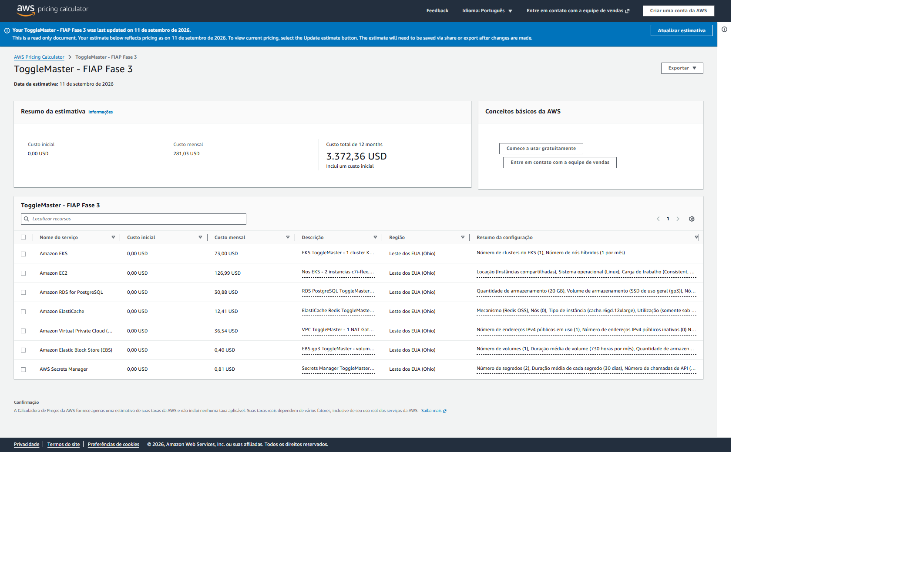

# Estimativa de custos AWS — ToggleMaster — Fase 3

**Data da consulta:** 2026-09-11  
**Região:** Leste dos EUA (Ohio), `us-east-2`  
**Ferramenta:** AWS Pricing Calculator  
**Link público:** https://calculator.aws/#/estimate?id=1717508852ab38c3aefc4acf0aa7f3de4a797ff9

## Resultado

| Serviço | Configuração estimada | Mensal |
|---|---|---:|
| Amazon EKS | 1 cluster Kubernetes 1.34 em suporte padrão | US$ 73,00 |
| Amazon EC2 | 2 × `c7i-flex.large`, Linux, sob demanda, 20 GB por nó | US$ 126,99 |
| Amazon RDS for PostgreSQL | 2 × `db.t3.micro`, Single-AZ, 20 GB gp3 por instância | US$ 30,88 |
| Amazon ElastiCache | 1 × Redis `cache.t3.micro` | US$ 12,41 |
| Amazon VPC | 1 NAT Gateway, 1 IPv4 público e 1 GB processado | US$ 36,54 |
| Amazon EBS | 1 volume gp3 de 5 GB, 3.000 IOPS e 125 MB/s | US$ 0,40 |
| AWS Secrets Manager | 2 segredos por 30 dias e 1.000 chamadas de API | US$ 0,81 |
| **Total mensal** | **730 horas** | **US$ 281,03** |
| **Total de 12 meses** | **sem desconto** | **US$ 3.372,36** |

## Limites da estimativa

- O valor representa a infraestrutura ligada durante o mês inteiro. No projeto,
  a camada `terraform/cluster` deve ser destruída ao fim de cada ensaio ou
  gravação.
- S3, ECR, SQS, DynamoDB e transferência de dados variam com uso. O volume
  acadêmico tende a ser pequeno, mas o custo real somente aparece na fatura.
- Preços, impostos e câmbio podem mudar depois de 2026-09-11.
- A estimativa usa dois RDS e um PostgreSQL em pod, conforme a exceção registrada
  em D-015.

## Evidência

